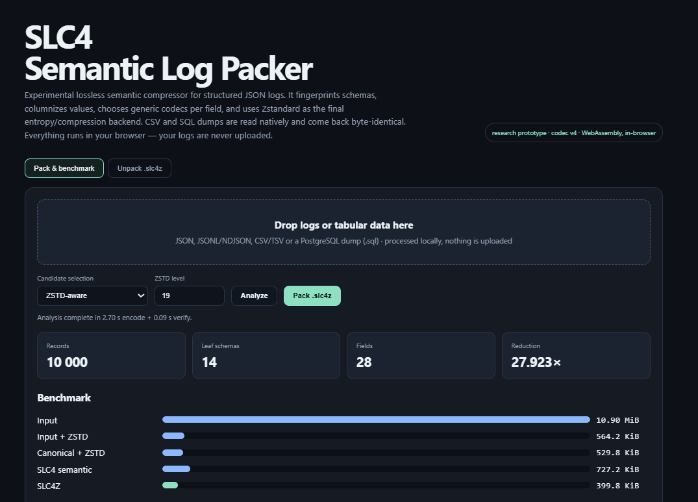

> **Translation note.** This is a translation of `research.pl.md`, which is the
> original and canonical text. Where the two disagree, the Polish version
> governs. Licensed CC BY 4.0.

# Abstract

Long-term archival of application, infrastructure and business logs is both a technical and an economic problem. Modern cloud platforms emit logs as semi-structured or structured data, most often JSON, and a large part of every record is repeated scaffolding: field names, resource identifiers, service names, severity levels, shared URL prefixes, timestamp and identifier formats. Classical compressors such as gzip or Zstandard see primarily a stream of bytes. They exploit local repetition very effectively, but they have no explicit knowledge that a given string is a timestamp, an IPv4 address, a number written as text, a hexadecimal identifier, a categorical column, or a field that is constant across thousands of records.[^zstd]

This document describes the path from an intuitive model of 2D/3D "frames" to a working prototype of a semantic log codec, provisionally named SLC4. The central idea is not to replace Zstandard with a bespoke entropy algorithm. Instead, the log is first transformed from its textual representation into a lower-entropy one: record schemas are detected, values are grouped into columns, and each column is assigned one of several lossless codecs — constant, dictionary encoding, RLE, bit packing, varint, delta, delta-of-delta, timestamp encoding, hex packing, front coding and others. Only the result of that stage is then compressed with Zstandard.

The defining feature of the fourth prototype is that representations are chosen not merely by the size of the intermediate format, but by the approximate size after subsequent Zstandard compression. The experiment showed this matters: on a real sample of 5 000 Cloud Run log records, the variant minimising the raw semantic stream produced 386.4 KiB before ZSTD and 210.6 KiB after ZSTD-19, whereas the "ZSTD-aware" variant produced a larger intermediate stream — 437.7 KiB — but a smaller final archive: 205.3 KiB. Canonical JSON compressed directly with ZSTD-19 occupied 273.6 KiB. In this experiment the semantic transformation therefore reduced the result by roughly 25.0% relative to a strong canonical-JSON + ZSTD-19 baseline, while preserving a full semantic round-trip of all 5 000 records.

A review of the literature makes clear at the same time that the general direction — detect structure, separate constants from variables, encode by type, and finish with a general-purpose compressor — has substantial prior art. Logzip, CLP, LogLite, DeLog, LogPrism and LogFold each develop variants of structural log compression.[^logzip][^clp][^loglite][^delog][^logprism][^logfold] LogFold in particular (2026) describes sub-token matrices and hybrid, type-dependent encoding selection, which is close to part of the intuition developed here.[^logfold] There is also a non-peer-reviewed project, `logpack`, whose public description is functionally very close to columnar JSON compression with automatic encoding selection.[^logpack] For that reason this document makes no claim of formal patentable novelty. The innovation of the prototype should be understood as a specific architectural combination and a research hypothesis: **a universal, field-name-agnostic codec for heterogeneous JSON, built on a schema registry, typed columnar streams, and transformation selection optimised against the final compressor**.

A second series of experiments, carried out on an independent implementation of the codec, confirmed these results and sharpened three points. The divergence between implementations was 3.3% in the intermediate stream and 0.1% in the final archive which, together with the measurement of columns in the fallback representation — 26.3% of the intermediate stream worth 1.4% of the archive — indicates that the intermediate stream is a poor predictor of the outcome and should not be used to prioritise work on codecs. The method's advantage turned out to depend strongly on chunk size, and that dependence is a function of the heterogeneity of the data: for multi-schema logs it falls from 24.8% to 3.9% when moving from 5 000 to 100 records per chunk, whereas for a single-schema relational table export it holds at 14.7% at just 1 000 rows. Finally, the principle of backend-aware selection itself requires qualification: a probe operating at a different compression level from the final compression can yield results worse than no selection at all.

Input was then extended to tabular formats — CSV and PostgreSQL dumps — for which the round-trip is byte-exact rather than merely value-level. The same dataset written three ways yields files differing by a factor of two and archives falling within 1.1% of one another, which indicates that archive size is approximately a property of the data rather than of its input representation. Type inference was also measured and degrades the result by 3.1%, because it breaks the uniformity of a column; this observation leads to the conclusion that partial type normalisation is worse than none.

The missing baseline was finally closed: the comparison against Parquet. Against the best of a swept grid of configurations, SLC4 is 6.8% smaller on logs and 8.4% smaller on the relational table — that is, **by single-digit percentages, not by tens of percent**, as comparisons against ZSTD alone had suggested. The spread between Parquet's own configurations was 26%, three times larger than the measured difference between the formats. Since Parquet offers selective column reads that the prototype lacks, the honest conclusion is that a size advantage is not sufficient justification for a new format; justification must be sought in the fidelity of representation, which a single-schema format cannot provide — and that too was measured.

**Keywords:** lossless compression, logs, JSON, Zstandard, schema fingerprinting, columnar encoding, dictionary encoding, delta encoding, delta-of-delta, RLE, data archival, chunking, relational data, Cloud Logging.

# Problem and motivation

## Why JSON is operationally convenient but archivally expensive

JSON was designed as a lightweight, textual, portable data-interchange format. It represents objects as sets of name–value pairs and permits arbitrary nesting of objects and arrays.[^json] These properties are excellent for interoperability, debugging and moving data between systems, but from an archival standpoint they create three classes of redundancy.

First, **structural redundancy**: field names are repeated in every record. If a million entries contain `resource.labels.project_id`, `resource.labels.service_name`, `timestamp`, `severity` and `logName`, those textual names appear a million times even though they describe the same structure.

Second, **low-cardinality value redundancy**: severity levels `INFO`, `WARNING`, `ERROR`, region names, a single service name or a resource type can be written as a few bits of dictionary index instead of a full string.

Third, **inefficient semantic representation**. A trace ID written as 32 hexadecimal characters occupies 32 ASCII bytes although it carries 128 bits of information, that is 16 bytes. An RFC 3339 timestamp is human-readable, yet a sequence of consecutive timestamps can often be represented as a base value plus small deltas. Similarly an IPv4 address can occupy 4 bytes rather than 7–15 characters, and numbers stored as strings need not be stored as ASCII digits.

Cloud Logging illustrates the problem well. The official `LogEntry` includes, among others, `logName`, `resource`, `timestamp`, `receiveTimestamp`, `severity`, `insertId`, `httpRequest`, `labels`, `trace`, `spanId` and one of the payloads: `protoPayload`, `textPayload` or `jsonPayload`.[^gcp-logentry] Cloud Run produces request logs as well as stdout/stderr and platform logs, all embedded in the `cloud_run_revision` structure.[^cloudrun-logging] This means a real log export is a mixture of several schemas sharing a very large common envelope.

The economic case for reducing bytes grows in the cold/archive tier, where storage is cheap but specific retention rules and read charges apply. Current Google Cloud Storage pricing, for example, describes a minimum storage duration and retrieval fees for the Archive class.[^gcs-pricing] This means a codec architecture should be judged not only on ratio, but also on encoding CPU cost, the volume of data retrieved and the expected frequency of restores; service prices themselves are a variable parameter and form no part of the algorithmic claims in this report.

## Why Zstandard alone does not close the problem

Zstandard is a modern lossless streaming compressor. The format described in RFC 8878 uses LZ-family dictionary-matching mechanisms together with entropy coding; it also supports external dictionaries and streaming operation.[^zstd] Practically speaking it is a very strong baseline for log archival: it finds repeated byte sequences, uses wide windows, and at high compression levels spends considerable CPU on better match search. Modern Zstandard also supports long-distance matching; the documentation notes that larger windows can improve ratio at the cost of memory.[^zstd-manual][^zstd-window]

The problem is that ZSTD is never told: "this column is a timestamp", "these 16 characters are fixed-width hex", "this field has only three values", "this URL has a constant host and a variable path". It sees only bytes. It will discover some of that regularity by itself, but often only after costly matching, or with a worse representation than a semantics-aware codec would use.

This leads to the project's basic hypothesis:

> **If, before Zstandard, we lower the entropy of the representation through a semantic transformation of structured logs, then ZSTD receives a stream that is easier to compress than the original JSON.**

The aim is therefore not to replace ZSTD, but to change the problem ZSTD has to solve.

# Theoretical background

## Entropy and the limit of lossless compression

Shannon's classical information theory formalises the intuition that the average number of bits needed to represent a source depends on the probability distribution of its symbols.[^shannon] For a symbol of probability $p$ the ideal information cost is:

$$
I(x)=-\log_2 p(x).
$$

If the value `INFO` appears in 90% of records, representing it every time with four ASCII characters is plainly suboptimal. Likewise, if consecutive timestamps usually differ by a few milliseconds, encoding a full 26–30 character string ignores the strong dependence between neighbouring values.

Lossless compression cannot "magically" remove random information. If `spanId` really is a random 64-bit identifier, then after stripping the ASCII overhead roughly 64 bits of incompressible content remain. The purpose of the semantic transformation is therefore not so much to compress the intrinsic entropy as to **separate intrinsic entropy from representational overhead and from correlations that are not visible to a byte-oriented compressor**.

## LZ77, Zstandard and repetition in the stream

In 1977 Lempel and Ziv presented a universal sequential compression algorithm based on reusing earlier fragments as references.[^lz77] The intuition is simple: instead of storing a sequence again, one can record the distance to its previous occurrence and the length of the match. In the LZ family the representation can therefore look conceptually like:

```text
literal: "resource.labels."
match:   offset = 847, length = 16
```

Zstandard extends this family, combining match search with efficient coding of literals and sequences. The implementation uses, among others, Huffman coding and Finite State Entropy, a variant of ANS.[^zstd][^ans]

That strength of ZSTD is also the reason the first experiment with arbitrary 2D geometry brought no advantage: when regularity can be expressed as ordinary byte repetition, ZSTD often discovers it perfectly well on its own.

## Dictionary, RLE, delta, front coding and columnarity

Many of the techniques that appeared in our prototype are classical elements of columnar formats. Parquet defines, among others, dictionary encoding, an RLE/bit-packing hybrid, `DELTA_BINARY_PACKED`, `DELTA_LENGTH_BYTE_ARRAY` and `DELTA_BYTE_ARRAY` (front compression of strings).[^parquet] Apache Arrow has explicit dictionary-encoded and run-end encoded representations and stores values columnwise.[^arrow]

This distinction matters: the project's innovation cannot consist in claiming that dictionary or delta encoding was invented here. These are mature techniques. The potential value lies in **the automatic composition of these techniques for heterogeneous logs and in the way the representation is chosen**.

## Delta-of-delta and temporal data

Gorilla, Facebook's time-series system, used delta-of-delta for timestamps and XOR for floating-point values, achieving substantial memory reduction for metrics.[^gorilla] If:

```text
T0 = 12:00:00.000
T1 = 12:00:00.100
T2 = 12:00:00.200
T3 = 12:00:00.300
```

then the first deltas are `100,100,100` and the second deltas `0,0`. Such a stream has very low entropy. In cloud logs timestamps are not perfectly periodic, but their intervals are still often small and correlated.

# State of the art and prior art

## Compact binary serialisations

CBOR is a standardised binary representation of a data model close to JSON. Its goals include small message size and a simple, unambiguous representation of binary types.[^cbor] CBOR removes some of JSON's textual overhead, for instance the ASCII encoding of numbers, but it does not itself reorganise a large collection of records into columns and does not exploit a globally repeated schema to the degree a columnar format or a log codec does.

## Columnar formats

Parquet is a particularly important point of reference, because it applies exactly many of the techniques we arrived at experimentally: dictionaries, RLE, bit packing, numeric deltas and front compression of strings.[^parquet] It is, however, an analytical format designed primarily for tables and columns, with a defined pages/row-groups model, and its writers have traditionally relied on encoding-selection heuristics. In 2025 the Parquet community held a public discussion about more dynamic encoding selection; it was noted that different implementations may try several encodings and pick the best.[^parquet-dynamic]

The database literature studied a similar problem earlier. CodecDB proposed data-driven selection of column encodings, arguing that rigid rules can lead to a suboptimal ratio.[^codecdb] From this project's standpoint that means **adaptive per-column codec selection also has prior art**.

## Log-specific compression

### Logzip

Logzip (2019) argues that general-purpose compressors do not fully exploit the hidden structure of logs. The method extracts structure through iterative clustering, producing coherent intermediate representations that then compress better. The authors report on average about half the space required by traditional compressors on the datasets studied.[^logzip]

### CLP

CLP (OSDI 2021) goes further: it losslessly compresses unstructured text logs while retaining the ability to search the compressed data efficiently. The gain comes from a specialised algorithm exploiting the repetitiveness of logs.[^clp] CLP demonstrates an important design direction: a log archive need not be merely "a file to be fully decompressed"; the format can retain structure that supports selective reads.

### LogLite

LogLite (2025) was designed as a lightweight, plug-and-play, streaming lossless compressor for TEXT and JSON, without predefined rules or training, and adapting to structural evolution.[^loglite] This is a notably close direction for the intended universality of our codec.

### DeLog

DeLog (2026) points out that template-parser accuracy is not the same thing as a good ratio. What matters more is grouping data into low-entropy sets and encoding such groups effectively.[^delog] This agrees very well with the V4 experience: the goal is not "perfect understanding of the log", but finding the transformation that yields the best final cost.

### LogPrism

LogPrism (2026) criticises the classical "parse-then-compress" pipeline and integrates structure extraction with variable encoding through a Unified Redundancy Tree. The authors report an advantage on most of 16 benchmarks and stress the importance of modelling structure and values jointly.[^logprism]

### LogFold

LogFold (ICSE 2026) is particularly close to our initial intuition. The authors decompose structured tokens into a delimiter skeleton and sequences of sub-tokens, then arrange the sub-tokens into conceptual columnar matrices. Within each column homogeneity of type, length or distribution appears, enabling specialised encoding.[^logfold] This is almost exactly the scientific version of the intuition that "a frame/matrix can reveal structure a byte compressor cannot see".

### `logpack` — very close engineering prior art

In April 2026 the publicly available GitHub project `Atomics-hub/logpack` described columnar compression of JSON logs: schema extraction, typed columns, template extraction, type-aware encoding, delta-of-delta for timestamps, binary IPv4/UUID/hex and adaptive ZSTD.[^logpack] This is functionally very close prior art for SLC4. The repository is not a peer-reviewed publication and had minimal adoption signals at the time of review, but from the standpoint of any claim to "uniqueness of the idea" it cannot be ignored.

## Conclusion from the literature review

The most important conclusion has two parts.

First, **the problem is real and actively researched**. The most recent literature, from 2025–2026, is in fact accelerating towards hybrid, type-dependent, structural log codecs.

Second, **most elements of SLC4 are not individually new**. Novelty must be sought in the detailed architecture, the optimisation criterion and the integration with heterogeneous JSON, not in the mere use of dictionaries, deltas or matrices.

# Evolution of the idea: from frame to semantic model

## Stage 1: a 2D frame and an occupancy mask

The original hypothesis was to place data in a two-dimensional matrix and describe the structure with a mask:

```text
####....
####....
........
........
```

For a 4×4 matrix the mask requires 16 bits. If many frames use the same masks, one can keep a dictionary of structures and replace the full mask with a small `structure_id`.

Intuitively this resembles dictionary encoding of the schema. The key discovery, however, was negative: **geometry alone does not create compression**. If every character still has to be stored, the mask is additional overhead. The gain appears only when the mask/schema allows a repeated description to be removed, or when values are strongly correlated between frames.

## A pedagogical bit-level example

Consider four eight-character chunks:

```text
F1 = ABCD1234
F2 = ABCD1235
F3 = ABCD1235
F4 = ABCD1236
```

In ASCII that is 32 characters, or 256 bits. Assume two possible 4×4 masks. A dictionary of two masks costs 32 bits, and four mask identifiers 4 bits. If each frame's values were still stored in full, the cost would rise to 292 bits: the transformation would be worse than the input.

If, however, we treat the first frame as a keyframe and the rest as deltas along the Z axis, the simplified cost might be:

- mask dictionary: 32 bits,
- mask IDs: 4 bits,
- full F1: 64 bits,
- delta F2: 15 bits,
- delta F3: 4 bits,
- delta F4: 15 bits.

In total: **134 bits instead of 256**, a 47.7% reduction in this didactic model. This is not a real format's result — some headers are omitted and a convenient delta model assumed — but the example shows where the gain actually arises: not from 2D, but from dependence between successive layers.

## Stage 2: the Z axis as delta / predictive coding

The third dimension was reinterpreted as a sequence of successive records or snapshots:

```text
FRAME 1 -> full state
FRAME 2 -> delta against FRAME 1
FRAME 3 -> delta against FRAME 2
...
```

This is close to predictive coding and temporal video compression. A classical trade-off appears immediately: the longer the delta chain, the better the potential ratio but the worse the random access. The remedy is keyframes/checkpoints.

## Stage 3: reinterpreting X/Y as fields and types

The most important conceptual change was to abandon physical character geometry. For logs the natural "matrix" is semantic:

```text
                 record 1      record 2      record 3
schema_id            3             3             7
timestamp            T0           +d1           +d2
severity            INFO           =          WARNING
status               200          404           404
service              #2            #2            #2
trace                 X1            X2            X3
```

The X/Y axes represent fields, types and structural components, and the Z axis successive records. Each "row" receives its own codec. At this point the concept ceases to be a matrix experiment and becomes **an adaptive columnar format for heterogeneous logs**.

# SLC4 architecture

## Design assumptions

Version V4 adopted five key assumptions:

1. no rules dependent on field names, e.g. no special code for `trace` or `latency`;
2. arbitrary nested JSON as input;
3. multiple schemas in a single archive;
4. automatic codec selection per column from a candidate set;
5. full reconstruction of JSON values and types in the same record order.

The semantically insignificant textual representation is not preserved: whitespace and JSON object key order. Under the JSON model an object is a collection of name–value pairs; the order of an object's members is not a semantic contract of the format itself.[^json]

After tabular inputs were added (described below) the contract ceased to be uniform, and it is worth setting out, because the difference is substantive rather than an implementation detail:

| Input | Round-trip guarantee |
|---|---|
| JSON, JSONL | values and record order; not whitespace or key order |
| CSV, TSV | **byte-exact** |
| PostgreSQL dump | **byte-exact** |

The asymmetry follows from the nature of the formats. JSON has a data model in which key order is not significant, so restoring it would mean storing information without content. CSV and SQL dumps, by contrast, are text files with no data model beyond the text: there every byte is content, and the only honest guarantee is a byte-level one.

## Step 0: the input layer

Originally the codec accepted JSON only. That restriction proved awkward for relational data: managed database systems export SQL dumps or CSV to object storage, not JSON, so any comparison would have to pass through an artificial conversion step that itself changes the representation and obscures the result. Readers for both formats were therefore added.

### Tabular values are read as text

CSV and the COPY text format have no type system — everything in them is a character string. The natural temptation is type inference, that is turning `"123"` into a number. The opposite approach was adopted: **values remain text**, and inference is an option, off by default.

The justification has two parts. First, inference is lossy with respect to the written form: `"0042"` would return as `42` and `"1.50"` as `1.5`, which for a database export is a change of content, not of form. Second — and this is the substantive argument — **the codec can already encode numbers written as text**: the `uintstr` and `numtemplate` codecs turn such columns into streams of integers. Preserving the text therefore costs far less than intuition suggests. Experiment H measures that cost and shows it to be negative: inference makes the archive larger.

### A SQL dump as a sequence of segments

A database dump is not a table. It is DDL, session settings, sequence and privilege definitions, with data blocks in between. The reader splits the file into two kinds of segment:

```text
[ literal  ]  comments, SET, CREATE TABLE, ALTER, CREATE INDEX ...
[ data     ]  COPY ... FROM stdin;  or individual INSERTs
[ literal  ]  ...
```

Data segments become columns; literal segments are stored verbatim. This yields a property worth stating explicitly: **constructs the codec does not model degrade to text, never to data loss**. A dump using syntax outside the supported subset — for example a multi-row `INSERT ... VALUES (...),(...)` in the MySQL style — will be archived without semantic transformation but will still reassemble byte for byte. Compression then degrades to plain ZSTD, which is exactly what one would obtain without the codec.

A dump with many tables is incidentally a natural application of the schema registry: each table contributes its own set of leaf paths and becomes a separate schema within the same archive.

## Step 1: flattening and schema fingerprinting

Each record is decomposed into leaf paths:

```text
resource.type
resource.labels.project_id
resource.labels.service_name
httpRequest.requestMethod
httpRequest.status
...
```

The schema signature is the ordered set of paths present in the record. Each unique set receives a `schema_id`. The structure is thereby not repeated for every record.

For the Cloud Run sample studied, 5 000 records produced only **14 unique leaf schemas** and **28 global leaf paths**. This strongly supports the hypothesis that a heterogeneous Cloud Logging export has a small number of repeated skeletons.

## Step 2: columnisation

For each leaf path a stream of values is built from only those records in which the field occurs. The record's schema later tells the decoder which columns to read when reconstructing a given object.

The effect is that values of the same kind end up adjacent:

```text
severity: INFO INFO WARNING INFO ...
status:   200  404  404     200  ...
timestamp: ...
spanId:   ...
```

This reveals regularities that in row-oriented JSON are separated by hundreds of bytes of other fields.

## Step 3: the candidate encoding set

Depending on type, V4 tests among others:

| Data class | Candidates |
|---|---|
| bool | bit-pack |
| integer | varint, delta, delta-of-delta, dictionary, RLE |
| timestamp-like string | integer nanoseconds + delta / delta-of-delta |
| decimal integer string | integer varint / delta |
| string with a single numeric token | numeric-template + mantissa/scale |
| IPv4 | 4 binary bytes |
| fixed-width hex | packing 2 hex characters -> 1 byte |
| low-cardinality string | dictionary + bit-packed IDs |
| string with long runs | RLE |
| string with a common prefix | prefix stripping |
| locally similar strings | front coding |
| everything else | raw UTF-8 or MessagePack fallback |

This approach converges with the idea of hybrid encoding in LogFold and with Parquet/Arrow techniques, but is applied to dynamic columns derived automatically from JSON.[^parquet][^logfold]

## Step 4: adaptive codec selection

The simplest selector chooses:

$$
e^*=\arg\min_e |C_e(x)|,
$$

where $C_e$ is an encoding candidate. The V4 experiment showed, however, that this is not the right objective function if the archive is going to be compressed with ZSTD afterwards.

The proper objective should be closer to:

$$
e^*=\arg\min_e |ZSTD(C_e(x),m_e)|,
$$

where $m_e$ denotes the metadata needed to reconstruct the encoding.

The prototype uses a cheap "oracle-lite" variant: each candidate together with its metadata is trial-compressed with ZSTD-1, and the winner is chosen by the size of that sample. The whole archive is then compressed with ZSTD-19. This is a heuristic, not a formally optimal algorithm, but a real benchmark confirmed its value.

## Step 5: the archive layer and ZSTD

The intermediate format consists of:

```text
SLC4 magic/version
metadata (MessagePack)
  - list of global paths
  - schema registry
  - schema_id encoding
  - per-column metadata
schema-id stream
column payloads
```

The whole stream is then compressed with ZSTD. The architecture is deliberately two-layered:

```text
JSON
  |
  v
semantic normalization / schema / columns
  |
  v
per-column encoding
  |
  v
SLC4 intermediate stream
  |
  v
ZSTD
  |
  v
archive
```

This separates two kinds of redundancy: semantic and byte-level.

# Experiments

## Methodology

The results below were reproduced on the prototype code saved during the work. Every lossless test ended with a round-trip check. For V4 the criterion was equivalent to:

```python
decoded == original
```

at the level of JSON/Python objects. ZSTD benchmarks were run with the `zstd` program in the version available in the test environment; the prototype reported levels `-3`, `-9` and `-19`.

It must be stressed that these are **exploratory experiments**, not a publication-grade performance benchmark: one host, small datasets, a Python implementation and no controlled series of repetitions. The size results are useful, but the timings should not be read as the target throughput of a production codec. The Parquet baseline in experiment I was computed with the `pyarrow` 25.0.1 library, with ZSTD compression at the same level 19 and a single row group, so that both sides worked with the full context.

### Two implementations and the sensitivity of results to the ZSTD build

Experiments D–G were run on a second, independent implementation of the codec in JavaScript. The same source file executes in Node and in the browser, and the ZSTD backend is injected: `node:zlib` on the Node side, WebAssembly on the browser side. This makes it possible to separate two sources of variability that are entangled in a single implementation.

This proved methodologically important. **The SLC4 semantic stream is deterministic** — given the same data and the same selection mode, both backends produce a byte-identical intermediate stream and an identical choice of codecs. What differs is the final ZSTD frame, because the zstd libraries in Node and in the WebAssembly build used are different versions: for ZSTD-19 on the same 433 235-byte stream this gave 210 780 B versus 210 438 B, that is 0.16%.

The recommendation for any future benchmark follows: **the size of the final archive is reproducible to within a fraction of a percent only within the same version of the zstd library**. Comparisons between systems should either report the backend version explicitly or refer to the semantic stream, which has no such variability. This does not invalidate the earlier figures, but it sets the threshold below which a difference between two codecs is not a signal.

The phrase "to within a fraction of a percent" proved too mild, however, and is corrected below. The 10 000-record measurement showed that **the divergence depends on the input and reached 4.6% on a baseline** — more than the entire advantage later measured over Parquet. Details, and the rejected hypothesis about window size, are in the section on backend divergence within experiment C.

## Experiment A: an arbitrary 2D frame on ordinary text

The first prototype packed repetitive JSON/text directly into 2D frames. The result was unambiguously negative:

| Representation | Size | % of baseline |
|---|---:|---:|
| input | 5.01 MiB | 100% |
| frame codec | 9.81 MiB | 196.02% |
| ZSTD-3 on input | 51.64 KiB | 1.01% |
| ZSTD-19 on input | 19.07 KiB | 0.37% |
| ZSTD-3 after frame codec | 256.81 KiB | 5.01% |
| ZSTD-19 after frame codec | 54.58 KiB | 1.06% |

Conclusion: **arbitrary 2D geometry is harmful** if it does not reveal new regularity. Repetitive text is ideal material for LZ/ZSTD, and the frame overhead merely disturbs byte locality.

## Experiment B: slowly changing 32×32 snapshots

The second test used 20 000 frames of 32×32, four unique masks and 3 840 000 occupied values. Between successive snapshots there were 60 265 changes.

| Representation | Size | % of baseline |
|---|---:|---:|
| naive mask + values | 6.10 MiB | 100% |
| frame codec | 144.81 KiB | 2.32% |
| ZSTD-3 naive | 115.77 KiB | 1.85% |
| ZSTD-19 naive | 131.64 KiB | 2.11% |
| ZSTD-3 frame codec | 116.31 KiB | 1.86% |
| ZSTD-19 frame codec | 116.41 KiB | 1.86% |

The frame codec achieved roughly a 43× reduction against the naive representation, but **ZSTD-3 on the naive representation was even slightly smaller**. This is an important scientific result: an explicit delta is not automatically better than a good dictionary compressor, if the compressor already sees strong local redundancy.

## Experiment C: a real Cloud Run sample

### Dataset characteristics

The file studied was **5 895 862 bytes (5.62 MiB)** and contained **5 000 records**. Stream distribution:

- 4 005 records `run.googleapis.com/requests`,
- 744 records `run.googleapis.com/stdout`,
- 251 records `run.googleapis.com/varlog/system`.

Across the 995 records containing `textPayload` there were only **9 unique values**. In the whole dataset **14 leaf schemas** and 28 global leaf fields were detected. This is a very favourable profile for dictionary encoding and schema IDs.

### V3: a semantic domain codec

V3 used even more knowledge about the nature of logs. The result:

| Representation | Size | % of input |
|---|---:|---:|
| original JSON | 5.62 MiB | 100% |
| canonical JSON | 4.61 MiB | 81.90% |
| semantic V3 | 517.6 KiB | 8.99% |
| original + ZSTD-19 | 290.1 KiB | 5.04% |
| canonical + ZSTD-19 | 273.6 KiB | 4.75% |
| **V3 + ZSTD-19** | **207.3 KiB** | **3.60%** |

V3+ZSTD-19 was roughly **24.3% smaller** than canonical JSON+ZSTD-19.

### V4: a universal codec with no dependence on field names

V4 chose encodings solely on the basis of column type and statistics. In the selection mode optimised for the final ZSTD it chose the following encoding classes:

```text
const=9
strdict=4
strrle=3
front=2
uintstr=2
hex=2
timestamp=2
numtemplate=1
strraw=1
intdict=1
prefix_hex=1
```

The round-trip of all 5 000 records succeeded.

| Representation | Size | % of input |
|---|---:|---:|
| original JSON | 5.62 MiB | 100% |
| canonical JSON | 4.61 MiB | 81.90% |
| V4 semantic, ZSTD-aware selection | 437.7 KiB | 7.60% |
| original + ZSTD-3 | 423.6 KiB | 7.36% |
| canonical + ZSTD-3 | 349.0 KiB | 6.06% |
| V4 + ZSTD-3 | 217.2 KiB | 3.77% |
| original + ZSTD-19 | 290.1 KiB | 5.04% |
| canonical + ZSTD-19 | 273.6 KiB | 4.75% |
| **V4 + ZSTD-19** | **205.3 KiB** | **3.57%** |

The final result corresponds to roughly **28.0× reduction against the original JSON export** and is about **25.0% smaller than canonical JSON + ZSTD-19**.

### A scaling check: 10 000 records

The natural question after the V4 result is whether the advantage holds on a larger sample, or was an artefact of the particular 5 000-record dataset. The same export, enlarged to 10 000 records (10.90 MiB), gives the same structural profile — **14 leaf schemas and 28 paths**, exactly as with half the data — which by itself supports the hypothesis of a small number of repeated skeletons.

| Representation | 5 000 records | 10 000 records | Ratio |
|---|---:|---:|---:|
| JSON input | 5.62 MiB | 10.90 MiB | 1.94× |
| canonical + ZSTD-19 | 273.6 KiB | 529.8 KiB | 1.94× |
| SLC4 semantic | 423.1 KiB | 727.2 KiB | 1.72× |
| **SLC4Z** | **205.5 KiB** | **402.8 KiB** | **1.96×** |
| advantage over canonical+ZSTD | 24.8% | 24.0% | – |




The advantage is **stable**: 24.8% at 5 000 records and 24.0% at 10 000. Neither the expected gain from scale appears — twice the stream length does not yield materially better dictionaries — nor any degradation. The only quantity growing sub-linearly is the intermediate stream (1.72×), which is expected, because schema and path metadata do not grow with the record count; after final compression that effect disappears.

The conclusion is moderately interesting and worth stating plainly: **on this dataset the method's advantage is a property of the structure of the data, not of its volume.** Enlarging the sample is therefore not a route to better results; the route is changing the class of data, which is what experiments F and H do.

### Backend divergence grows with input size

The 10 000-record measurement revealed a phenomenon invisible on the smaller sample, and it forces the warning in the methodology section to be sharpened.

The screenshots above come from the browser implementation, that is from ZSTD in WebAssembly. Values recomputed independently by the implementation using `node:zlib` agree **exactly** wherever byte compression plays no part — canonical + ZSTD-19 is 529.8 KiB in both, and the semantic stream 727.2 KiB in both, confirming that the data and the codec's decisions are identical. Two quantities do diverge, however:

| Quantity | WebAssembly | `node:zlib` | Divergence |
|---|---:|---:|---:|
| SLC4Z | 399.8 KiB | 402.8 KiB | 0.75% |
| input + ZSTD-19 | 564.2 KiB | 539.4 KiB | **4.60%** |

On the 5 000-record sample the latter quantity was **identical** in both backends (290.1 KiB). The divergence is therefore not a fixed fraction of a percent, as the original wording of the methodology section suggested — **it depends on the input and can reach several percent**.

The hypothesis was advanced that the ZSTD window size is responsible: level 19 uses an 8 MiB window by default, within which the 5.62 MiB sample fits entirely while 10.90 MiB does not. The hypothesis was **tested and rejected**: forcing `windowLog` to 23 and 24, and disabling long-distance matching, changed the result by 0.1 KiB, that is by 0.02%. The most likely explanation remains a difference in the level-19 parameter presets between versions of the zstd library, of a magnitude depending on the nature of the input, but it has not been isolated.

The consequence for the document as a whole is more serious than it looks. A 4.6% divergence on a baseline is **larger than SLC4's entire advantage over Parquet** as measured in experiment I (6.8% and 8.4%). This means a format comparison in which the two sides were computed with different zstd builds could reverse the sign of the result. All figures in experiment I come from a single backend and a single library version on both sides, but the rule going forward must be stricter than before: **the version of the compression library must be reported alongside the result, and backends must never be mixed within a single comparison.**

### Why "a smaller intermediate" does not mean "a smaller archive"

This is one of the most interesting results of the whole series. V4 run with an objective function minimising only the raw intermediate format achieved:

- SLC4: 386.4 KiB,
- SLC4 + ZSTD-19: 210.6 KiB.

The ZSTD-aware variant:

- SLC4: 437.7 KiB,
- SLC4 + ZSTD-19: 205.3 KiB.

The intermediate stream was therefore over 50 KiB larger, and the final archive 5.3 KiB smaller. The explanation is intuitive: some transformations remove redundancy in a way that shrinks the payload itself but simultaneously produces a less regular stream for ZSTD. Others leave a certain "cheap redundancy" that the backend compresses very effectively.

This justifies designing the selector **in the context of a specific backend**, not independently of it.

### Results for the three log classes separately

| Class | Count | canonical + ZSTD-19 | V4 + ZSTD-19 | improvement |
|---|---:|---:|---:|---:|
| request logs | 4 005 | 248.5 KiB | 194.9 KiB | 21.6% |
| stdout | 744 | 24.9 KiB | 20.8 KiB | 16.7% |
| system | 251 | 17.9 KiB | 16.9 KiB | 5.7% |

Not every class benefits to the same degree. The largest effect appears where structure and types are rich and repetitive. System logs, with short and relatively non-uniform messages, leave less semantic redundancy to exploit.

Interestingly, a combined archive of all classes is smaller than the sum of three separate archives. This suggests it is worth retaining the ability to exploit shared elements — resource, service identifiers, namespace, region and so on — across the boundaries of a single log kind.

This observation returns in experiment E in quantitative form: it is the same mechanism that determines the cost of chunking a stream.

## Experiment D: reproduction in an independent implementation

Porting the codec to a second implementation offered a chance to check whether the results of experiment C are a property of the method or an artefact of particular code. A criterion stronger than round-trip was adopted: archives from the new implementation had to have an **identical SHA-256** to those from the previous one, for both selection modes and ZSTD levels 3 and 19, and additionally archives from one implementation had to open in the other.

The same Cloud Run sample, computed entirely on the browser side:

| Representation | V4 (report, Python) | Browser implementation |
|---|---:|---:|
| original + ZSTD-19 | 290.1 KiB | 290.1 KiB |
| canonical + ZSTD-19 | 273.6 KiB | 273.6 KiB |
| **SLC4 + ZSTD-19** | **205.3 KiB** | **205.5 KiB** |

The number of records, leaf schemas and fields reproduced exactly: 5 000 / 14 / 28. The round-trip of all 5 000 records was confirmed semantically.

What is interesting, however, is not the fact of reproduction but the distribution of differences. The intermediate stream of the two implementations is **not** identical: 423.1 KiB against 437.7 KiB, that is 3.3% less, because the selector in the new implementation resolved one column in favour of `strdict` where the previous one chose `strraw`. Even so, the final archive came out 0.1% **larger**.

This is an independent confirmation of the observation in the section on "a smaller intermediate", this time obtained by accident rather than by a deliberate change of objective function. Two implementations of the same method, differing in a single encoding decision, diverged by 3.3% in the intermediate stream and converged to 0.1% in the archive. It strengthens the thesis that **the intermediate stream is a weak predictor of the final result** and should not be used as a measure of codec quality.

## Experiment E: the cost of chunking a stream

Archiving "in flight" requires chunking: the codec is batch-oriented, so a stream must be buffered into a chunk and only then encoded. The question is what such a decision costs. The 5 000-record Cloud Run sample was divided into chunks of varying size, each encoded independently, and the archives summed. The `canonical + ZSTD-19` baseline was chunked identically, so that the comparison is fair — cutting harms both sides.

| Chunk | Chunks | SLC4Z total | Overhead | canonical + ZSTD total | SLC4 smaller by |
|---:|---:|---:|---:|---:|---:|
| 100 | 50 | 322.7 KiB | +56.8% | 335.7 KiB | **3.9%** |
| 250 | 20 | 267.4 KiB | +29.9% | 306.1 KiB | 12.6% |
| 500 | 10 | 240.3 KiB | +16.7% | 293.4 KiB | 18.1% |
| 1 000 | 5 | 225.4 KiB | +9.5% | 284.5 KiB | 20.8% |
| 2 500 | 2 | 211.3 KiB | +2.6% | 276.6 KiB | 23.6% |
| 5 000 | 1 | 205.9 KiB | – | 273.6 KiB | 24.8% |

The single-chunk row (205.9 KiB) differs by 0.4 KiB from the value given in experiment D, because the archive header stores the source file name and it was different in this run. The difference is constant and does not affect comparisons within the table; we note it because it is a good reminder that at this scale of effects even container metadata is visible in the result.

The result is unambiguous and has direct design consequences: **the advantage of the semantic transformation degrades faster than the advantage of ZSTD alone**. At 100 records per chunk SLC4 leads ZSTD by 3.9%, which is about the measurement noise described in the section on build sensitivity. Below that threshold the codec ceases to be justified.

The cause is structural. The schema registry, the path table and the column metadata are an approximately fixed cost per chunk, while dictionaries, front coding and RLE need sufficiently many values in a column to amortise. Encoding time does not grow with it — it stayed in the 0.8–1.3 s range regardless of the split — so the constraint is the representation, not the CPU.

For the log profile studied, **the profitability threshold lies around 500–1 000 records per chunk**, with saturation reached at a few thousand. This is not a universal constant; it is a function of the number of schemas and fields, as experiment F shows directly.

## Experiment F: relational data instead of logs

All measurements so far concerned logs, that is heterogeneous data with many schemas. The natural question is whether the method carries over to an export of a table from a relational database, where there is exactly one schema.

The dataset is **synthetic** and that limitation should be taken seriously: it models an orders table (50 000 rows, JSONL, 20.86 MiB) with columns typical of transactional data — `bigserial`, UUID, two `timestamptz`, a foreign key, enumerated columns, `numeric(12,2)`, `double precision`, `boolean`, an IP address, an e-mail address, a nullable text column and `jsonb`. Two export variants were studied: with NULLs written explicitly and with them omitted.

CSV was added to the baselines, because for a flat table it is a real competitor rather than a theoretical one.

Variant with explicit NULLs:

| Representation | Size |
|---|---:|
| JSONL | 21 358.8 KiB |
| JSONL + ZSTD-19 | 3 212.9 KiB |
| CSV | 11 661.8 KiB |
| CSV + ZSTD-19 | 3 105.5 KiB |

| Chunk | SLC4Z total | vs JSONL+ZSTD | vs CSV+ZSTD |
|---:|---:|---:|---:|
| 1 000 | 2 741.3 KiB | -14.7% | -11.7% |
| **10 000** | **2 467.3 KiB** | **-23.2%** | **-20.5%** |
| 50 000 | 2 351.5 KiB | -26.8% | -24.3% |

The variant with NULLs omitted behaves almost identically (-14.3% / -23.3% / -26.8% against JSONL+ZSTD), with the difference that omitting NULLs allows the text column to leave the fallback, because it ceases to be a mixed-type column.

Two conclusions.

First, **the method carries over to relational data** and retains its advantage not only over JSONL+ZSTD but also over CSV+ZSTD, that is over a representation that has already removed all field-name redundancy.

Second, and this is the more interesting result, **single-schema data tolerates chunking far better than logs**. At 1 000 rows per chunk the advantage is still 14.7%, whereas in experiment E at 100 records it fell to 3.9%. The mechanism is the one described above: a table has one schema and a fixed path list, so chunk metadata is small and does not grow. Taken together, experiments E and F suggest a practical rule: **the minimum sensible chunk size scales with the heterogeneity of the data, not with its volume**.

### What columns in the fallback really cost

Column diagnostics showed that `score` (`double precision`), `amount` (`numeric`), `tax_rate` (`numeric`) and `notes` (nullable text) fall into the MessagePack fallback and occupy 26.3% of the semantic stream. This would suggest that the absence of a floating-point codec is the largest functional gap. Measurement does not confirm that.

On a 10 000-row chunk, after ZSTD-19:

| Variant | Archive | Change |
|---|---:|---:|
| as is | 488.5 KiB | – |
| UUIDs without hyphens, i.e. the `hex` codec instead of `strraw` | 442.4 KiB | **-9.4%** |
| amounts as strings, i.e. `numtemplate`/`strdict` instead of the fallback | 481.5 KiB | -1.4% |
| both together | 431.9 KiB | -11.6% |

Floating-point columns, occupying more than a quarter of the intermediate stream, are worth **1.4%** of the archive, because ZSTD handles MessagePack blobs better than their size would suggest. The real gap lies elsewhere: the `hex` codec requires a uniform fixed-width hexadecimal string, and the hyphens in a UUID disqualify it, so a 36-character text goes as `strraw`. Generalising that codec to patterns with fixed separators is worth **9.4%**, and surrogate keys in the form of UUIDs are ubiquitous in databases.

This is the third appearance of the same principle in this document, this time in inverted form: a representation that looks expensive in the intermediate stream may be cheap after compression. **Prioritising work on codecs must rest on measuring the archive, not on the profile of the intermediate stream.**

## Experiment G: the selector is backend-aware but not aware of its operating point

The section on architecture step 4 describes a selector that scores candidates by their size after ZSTD compression. In the implementation the trial compression is always performed at level ZSTD-1, regardless of the level with which the archive will ultimately be packed. Measurement on the Cloud Run sample shows this is not neutral:

| Final level | `raw` selection | ZSTD-aware selection |
|---|---:|---:|
| ZSTD-3 | **226.2 KiB** | 226.6 KiB |
| ZSTD-19 | 211.3 KiB | **205.8 KiB** |

At level 19 backend-aware selection wins by 2.6%, in line with the document's thesis. At level 3 it **loses to no selection at all**, though by little. In other words: a probe at level 1 is a good approximation of ZSTD-19's behaviour, and a worse approximation of ZSTD-3's, even though numerically it is closer to the latter.

This result does not undermine the thesis of selection with the backend in the loop — it sharpens it. The backend is not merely an algorithm, but an algorithm **at a particular operating point**, and a divergence between the probe's operating point and that of the final compression can erase the entire gain from selection. This is a directly falsifiable hypothesis: whether a probe at the level equal to the final level improves the result enough to justify its CPU cost.

## Experiment H: the same table in three representations

Adding CSV and SQL readers made it possible to pose a question that could not previously be asked cleanly: **how much of the result depends on the data and how much on the format in which it was exported?** The same 50 000-row dataset from experiment F was written three ways — as CSV with a header, as a `pg_dump` dump with a COPY block and full DDL, and as JSONL. Each was compared with its own baseline, that is the same file after ZSTD-19.

| Format | Original | + ZSTD-19 | SLC4Z | SLC4Z smaller by | Round-trip |
|---|---:|---:|---:|---:|---|
| CSV | 9.15 MiB | 2 995.9 KiB | 2 287.0 KiB | 23.7% | byte-exact |
| SQL dump | 9.22 MiB | 3 000.6 KiB | 2 306.0 KiB | 23.1% | byte-exact |
| JSONL | 19.33 MiB | 3 146.4 KiB | 2 280.5 KiB | 27.5% | values |

The advantage holds in every representation, including over CSV+ZSTD, that is over a format that has already removed all field-name redundancy on its own. What is interesting, however, is the distribution rather than the bare fact.

**The input files differ twofold; the archives fall within 1.1% of one another.** JSONL is more than twice the size of CSV, and its ZSTD baseline is still 5% larger; after the semantic transformation all three converge into the 2 280–2 306 KiB range. This suggests that **archive size is approximately a property of the data rather than of the way it was written** — which is what one would expect from a codec that normalises representation, but which was worth measuring rather than assuming.

The qualifier "approximately" is necessary here for two reasons, and both are instructive.

First, **these three files are not semantically identical**. CSV does not distinguish a NULL value from an empty string, so the `notes` column is uniformly textual in it, whereas in the SQL dump and in JSONL it contains empty values alongside text. The consequence is visible in the column diagnostics:

| Column | CSV | SQL dump |
|---|---|---|
| `notes` | `front`, 341.7 KiB | `msgpack`, 350.0 KiB |

A mixed-type column falls into the fallback representation; a uniform one gets front coding. **The less expressive format compressed better precisely because it is less expressive** — losing the distinction between NULL and the empty string accidentally spared the column from the fallback. This is the same weakness that experiment F noted for nullable columns, observed here from the other side.

Second, the SQL dump carries DDL that the other representations lack. This turned out to be quantitatively irrelevant, however: the literal segments are 905 B of text, 477 B after ZSTD-19, against a 19 KiB difference between the SQL and CSV archives. **The difference is accounted for by the representation of values, not by the presence of DDL.**

### Type inference makes the result worse

The decision to read tabular values as text was described in the architecture as justified by the fact that the `uintstr` and `numtemplate` codecs already encode numbers written as text. That claim needed checking, since it is falsifiable.

| Mode | Semantic stream | SLC4Z |
|---|---:|---:|
| values as text (default) | 5 319.0 KiB | **2 287.0 KiB** |
| with type inference | 5 882.4 KiB | 2 358.9 KiB |

Inference **enlarged the archive by 3.1%**, and the intermediate stream by 10.6%. The mechanism is visible in the columns:

| Column | Text | With inference |
|---|---|---|
| `amount` (`numeric(12,2)`) | `numtemplate`, 151.8 KiB | `msgpack`, 433.4 KiB |
| `score` (`double precision`) | `numtemplate`, 152.2 KiB | `msgpack`, 434.1 KiB |

The cause is not a weakness of the inference but its **incompleteness**. The conversion is conservative: it turns a value into a number only when printing that number yields exactly the same text. For a monetary column this means `"3400.45"` becomes a number while `"1000.00"` remains text, because `1000` is a different written form from `1000.00`. A column that was uniformly textual becomes mixed — and lands in the fallback representation, which costs almost three times as much.

The conclusion is more general than this one flag: **partial type normalisation is worse than none**. The value of a columnar representation comes from uniformity, so a transformation that improves the type of some values can destroy the property on which the entire gain rests. This is an argument for any future floating-point codec to operate on a whole column at once rather than on values individually.

## Experiment I: the Parquet baseline

The absence of a comparison against Parquet was flagged in earlier versions of this document as the main gap — rightly, because Parquet implements exactly the techniques the prototype arrived at independently: dictionaries, RLE, bit packing, numeric deltas and front coding of strings.[^parquet] Once CSV and SQL-dump readers were added, the comparison could be made without an artificial conversion through JSON, so the gap was closed.

The result is markedly less favourable to SLC4 than earlier comparisons against ZSTD alone would suggest, and that is the most important thing this experiment contributes.

### Methodology and the fairness principle

`pyarrow` 25.0.1 was used. Parquet was configured to show at its best: ZSTD at the same level 19 as SLC4, a single row group (the equivalent of a single SLC4 chunk, so both sides use the full context), and dictionaries enabled where they help.

A principle was adopted that is worth recording, because comparing against one's own competitor is a situation with a built-in conflict of interest: **we do not compare against the default configuration, but sweep a grid of settings and take the minimum**. For the relational table 17 configurations were examined, for the logs 4 (a nested schema does not allow per-column encodings). The best for tabular data proved to be `DELTA_BINARY_PACKED` for integers and `DELTA_LENGTH_BYTE_ARRAY` for strings, with dictionaries disabled; for logs, disabled dictionaries with version 1.0 data pages.

### Two measurement errors and what they teach

The first two attempts at this measurement were wrong, in both cases **in favour of one side**. We describe them because both are typical, both would have passed unnoticed, and both produced figures that looked credible.

**Error one: silent data loss on the baseline side.** The Parquet table for the logs was built with `pa.Table.from_pylist`, which infers the schema from the first record. Since the first record of the Cloud Run sample contains none of the fields `httpRequest`, `severity`, `spanId`, `trace` or `traceSampled`, the function **silently dropped 5 of the 12 top-level keys** — including the whole `httpRequest` structure, which carries the largest part of the request logs. The result was 102.5 KiB and looked like a twofold advantage for Parquet over SLC4.

The warning sign was not the size itself but the column count: 7 against the 28 leaf paths that SLC4 detects in the same dataset. A correct measurement required `pyarrow`'s JSON reader, which unifies the schema across the whole file; the control was agreement in the number of leaf paths (28) together with a comparison of the reconstructed records against the original.

The conclusion is general: **the baseline must be validated just as the format itself is**. The prototype had a mandatory round-trip check from the beginning; the baseline had none, and that was enough to spend a while comparing an archive of everything against an archive of half the data. Every future "SLC4 vs X" figure should be preceded by a check that X actually encoded the same data.

**Error two: a configuration picked by hand, that is in one's own favour.** The "tuned" Parquet variant was initially configured according to our own guess about what should help. Sweeping the grid showed the guess was 7% worse than the optimum: 2 671.8 KiB against 2 495.7 KiB. SLC4's advantage consequently fell from 14.4% to 8.4%.

Here the conclusion is simpler still: **when comparing against a competing format, choosing its settings by hand is not a method.** One must either sweep, or report the default configuration and call it the default — never a single variant labelled "tuned", because such a choice will always be open to the suspicion of bias, however unintentional.

### Results: Cloud Run logs

5 000 records, 14 leaf schemas, 28 paths, ZSTD-19 on both sides.

| Representation | Size | vs best Parquet |
|---|---:|---:|
| JSON + ZSTD-19 | 290.1 KiB | +31.4% |
| canonical JSON + ZSTD-19 | 273.6 KiB | +23.9% |
| Parquet, default configuration | 260.3 KiB | +17.9% |
| Parquet, best of 4 configurations | 220.8 KiB | – |
| **SLC4Z** | **205.8 KiB** | **-6.8%** |

### Results: the relational table

The same synthetic 50 000-row dataset as in experiments F and H, read from CSV.

| Representation | Size | vs best Parquet |
|---|---:|---:|
| CSV + ZSTD-19 | 2 995.9 KiB | +20.0% |
| Parquet typed, default configuration | 3 205.3 KiB | +28.4% |
| Parquet text, default configuration | 3 056.7 KiB | +22.5% |
| Parquet, best of 17 configurations | 2 495.7 KiB | – |
| **SLC4Z, values as text** | **2 287.0 KiB** | **-8.4%** |
| SLC4Z with type inference | 2 358.9 KiB | -5.5% |

It is worth noting that Parquet in its default configuration performed **worse than CSV+ZSTD-19**, and after tuning 20% better. The spread between the best and worst configuration was 26% for the table and 19% for the logs. This is an argument for always stating settings in published format comparisons — the difference between configurations here is larger than the difference between formats.

### The difference that is not about size

Comparing sizes alone omits something more important: **these representations are not equivalent**.

Parquet does not distinguish "the field is absent" from "the field is present and its value is null". Flattening the 14 Cloud Run log schemas into one wide schema meant that **all 5 000 records came back with keys they did not have** — on average 2.73 extra keys per record. Semantic equality holds only after removing null-valued keys from both sides. For Cloud Logging this is not an academic subtlety: the presence of `textPayload` versus `jsonPayload` carries information about what kind of entry it is.

This is therefore the first quantitative evidence that the schema registry — identified in this document as a differentiator — really does store information that a single-schema format does not. That differentiator, however, manifests itself in fidelity of representation, not in size.

On the tabular side the asymmetry is reversed and equally concrete: SLC4 reproduces a CSV file byte for byte, whereas Parquet does not store CSV formatting at all — neither the delimiter, nor the quoting convention, nor the line endings. The typed variant additionally loses the written form of numbers, turning `1000.00` into a value whose printed form is `1000`.

### What this experiment does not show

One writer (`pyarrow`) was measured, and a dozen or so configurations, not the space of all settings or all implementations. The relational dataset is synthetic. Neither time nor memory was measured, and in that respect Parquet has a mature native implementation against which a JavaScript prototype is no competition.

The most important caveat, however, is of a different kind and should be stated plainly. **Parquet is 6–8% larger, but it allows selected columns to be read, filtering without full decompression, and it is read natively by the entire analytical ecosystem.** SLC4 can do none of these things — an archive must be decoded in full. For most archival applications in which data is to remain even potentially queryable, a few percent of volume is a low price, and Parquet remains the better engineering choice.

SLC4's advantage makes sense within a narrower scope, worth naming precisely: when data is restored in full or not at all, when byte-level fidelity to the source file matters, and when the dataset is heterogeneous enough that a single-schema representation loses information about field presence. Outside that scope, the justification for further work on the format is its value as research, not a practical advantage.

# What is genuinely different about this approach

## Elements that are not new

A scientifically sound assessment must clearly separate our own contribution from previously known techniques. The following are not new:

- dictionary encoding;
- RLE and bit packing;
- varint and ZigZag;
- delta and delta-of-delta;
- columnar storage of values;
- front coding of strings;
- binary packing of hex/IP;
- the general idea of "preprocess, then general compressor";
- schema extraction for logs;
- adaptive encoding selection as an optimisation problem.

All of these have solid prior art in columnar formats, time-series systems, databases and the log-compression literature.[^parquet][^arrow][^gorilla][^codecdb][^logfold]

## The potentially distinguishing combination in SLC4

At the current stage the most interesting properties are the following, combined **simultaneously**:

### 1. A model of arbitrary, heterogeneous JSON rather than a single table schema

SLC4 builds a registry of many leaf schemas within one archive and encodes their sequence. It requires no prior DDL and no single stable schema. This matches the realities of cloud-native logs, where request logs, stdout and platform logs can coexist in one export.

After tabular readers were added, this mechanism turned out to have wider application than assumed: a database dump with many tables uses it in exactly the same way, because each table contributes its own set of paths. The schema registry therefore ceases to be a solution to a log-specific problem and becomes a general mechanism for archiving heterogeneous record sets in a single file.

### 2. No dependence on field names

A rule such as "if the key is `trace`, pack hex" is easy but domain-specific. V4 examines values and types independently of the path. A fixed-width string consisting of hex can be packed regardless of whether it is called `spanId`, `hash`, `transaction_id` or anything else.

### 3. Transformation selection as a problem with the backend in the loop

The most original element of the prototype is treating the final compressor as part of the objective function. Instead of asking "which encoding is smallest?", we ask "which encoding, after passing through the chosen backend, gives the shortest result?". This is not entirely without precedent — database systems study dynamic selection, and the Parquet community discusses dynamic encoding advisors[^parquet-dynamic][^codecdb] — but in our prototype the principle is very direct and forms a central element of the format's design.

Experiment G imposes an important qualification on this. Backend awareness proves insufficient if the probe operates at a different operating point from the final compression: at ZSTD-19 selection yields a 2.6% gain, while at ZSTD-3 it loses its advantage over no selection at all. The claim must therefore be formulated more carefully — the differentiator is not "backend-aware selection" but **selection aware of the backend at the same operating point at which the backend will actually run**. Whether closing that gap pays for its CPU cost remains an open question.

### 4. Deliberately preserving redundancy that benefits ZSTD

Typical preprocessing assumes every stage should locally shrink the data. The V4 result shows a counterexample: a locally larger representation can globally yield a smaller file. This matters for designing the pipeline as a single optimisation system.

### 5. An explainable per-column codec

Every column has an explicit decision: `const`, `strdict`, `timestamp`, `front`, `hex`, and so on. This eases diagnostics, ablation studies and future automatic learning of the selector.

## The limits of the innovation claim

After the literature review of September 2026 it would not be honest to claim that "nobody does semantic log compression" or "nobody encodes columns by type". LogFold, LogPrism, LogLite, DeLog and `logpack` show this is an active and competitive area.[^loglite][^delog][^logprism][^logfold][^logpack]

The proper research hypothesis is therefore rather:

> **Can a general, schema-registry-based codec for heterogeneous JSON with backend-aware selection achieve a better ratio of size, speed and universality than direct ZSTD, Parquet/Arrow and current log-specific compressors?**

That is a falsifiable question suitable for publication-grade evaluation. Experiment I answers the part concerning Parquet — and the answer comes out **weaker than the hypothesis assumed**.

On size: yes, by 6.8% on logs and 8.4% on the relational table. On speed: not measured, and the advantage should be expected on the side of Parquet's native implementation. On universality: SLC4 reads more input formats and preserves more structural information, but offers no selective read, which for an archival format is a feature rather than an extra.

The hypothesis should therefore be narrowed to a form that remains non-trivial but promises no more than measurement has shown:

> **Can a codec based on a schema registry, selecting encodings automatically, achieve a smaller size than a hand-tuned columnar format — while preserving a fidelity of representation that a single-schema format cannot preserve?**

Posed this way, the question has the advantage that both of its clauses have already been partly measured, and it additionally indicates where the advantage should not be sought: in the compression ratio itself, because there the difference is smaller than the spread arising from the competitor's settings.

# Conceptual comparison

| Approach | Understands structure | Columnisation | Type-dependent encodings | Heterogeneous schemas | Backend-aware selection | Search without full decode |
|---|---|---|---|---|---|---|
| ZSTD | no | no | no | n/a | n/a | no |
| CBOR | partly | no | base types | yes | no | no |
| Parquet | yes | yes | yes | rather schema/table oriented | depends on writer | yes, selectively |
| CLP | log-specific | internally | yes/specialised | log text | own model | yes |
| LogFold | yes, tokens | sub-token matrices | yes | log-oriented | no such criterion shown here | not its main goal |
| logpack | yes, JSON | yes | yes | yes | adaptive ZSTD | partly/format-dependent |
| **SLC4 prototype** | yes, nested JSON | yes | yes | yes | **yes, explicit objective** | not yet |

The table is conceptual. It does not substitute for an experiment on shared datasets and is not a performance ranking.

Two of its rows, however, have ceased to be conjecture. The "heterogeneous schemas" cell for Parquet — described cautiously as "rather schema/table oriented" — was measured in experiment I: flattening the 14 Cloud Run log schemas adds on average 2.73 null-valued keys per record and affects all 5 000 records. The SLC4 row in the "search without full decode" column, in turn, remains an honest "not yet", and it is that column, not size, that decides Parquet's advantage in practice today.

It is also worth noting that in the "backend-aware selection" column Parquet is marked "depends on writer". Experiment I showed how much lies behind that: the spread between configurations of the same writer was 26%, more than the difference between the formats. For Parquet the choice of encodings is therefore an open problem on the user's side, whereas SLC4 solves it automatically — which is its real practical differentiator, independent of a few percent of volume.

# Limitations of the current results

## One real sample is not enough

5 000 Cloud Run records are a valuable proof-of-concept but not proof of universality. The dataset has very favourable properties: few schemas, many constant resource fields and a large share of structured request logs.

Experiment F added a second class of data — a relational table export — but the dataset is **synthetic** and that is a serious caveat. Cardinality distributions, the share of NULLs and text field lengths were assumed rather than observed; the qualitative conclusions (that the method carries over, that single-schema data resists chunking) are probably stable, but the specific percentages should be treated as orders of magnitude, not measurements. The dataset did, however, reveal one thing independent of distributions: a structural gap in the `hex` codec with respect to identifiers containing fixed separators. That observation is independent of the synthetic data, because it concerns a codec's matching condition rather than value statistics.

Tests are needed on:

- Kubernetes/GKE logs;
- Cloud Logging from many services and many revisions;
- AWS CloudWatch and Azure Monitor;
- application JSONL logs with dynamic payloads;
- text logs requiring template extraction;
- stack traces and multi-line exceptions;
- audit logs;
- very high-cardinality UUID/hash/trace;
- data with frequent schema evolution.

## The Parquet baseline: closed, with caveats

The absence of this comparison was flagged in earlier versions of the document as the main gap. Experiment I closes it: SLC4 comes out 6.8% smaller on logs and 8.4% smaller on the relational table against the best of the swept Parquet configurations.

The advantage is therefore **single-digit**, not tens of percent as comparisons against ZSTD alone would suggest. This is the most important correction this baseline brought to the whole document: figures such as "28× reduction" describe the distance from raw JSON, not from the state of the art in structured-data compression.

Three caveats remain that experiment I does not remove.

First, **one writer was measured** (`pyarrow`) and a dozen or so configurations, not the space of all settings or all implementations. The spread between the best and worst configuration examined was 26%, three times more than the measured difference between the formats — which by itself counsels caution.

Second, **computational cost was not measured**. Parquet has a mature native implementation against which a JavaScript prototype is no competition, and for an archival format throughput is a design parameter, not a detail.

Third, and most importantly, **a size comparison omits the difference in capability**. Parquet allows selected columns to be read and filtering without full decompression; SLC4 requires decoding everything. A few percent of volume is a low price for that, so for applications in which data is to remain even potentially queryable, Parquet remains the better choice. The scope in which SLC4 makes sense is narrower and is described at the end of experiment I.

## No tests against the latest log-specific compressors

To speak of the state of the art, SLC4 should be compared at least with:

- ZSTD/Gzip/XZ as general-purpose baselines;
- Parquet+ZSTD;
- CLP;
- LogLite;
- DeLog;
- LogPrism;
- LogFold;
- `logpack` as a very close public engineering solution.

## CPU and memory cost of the selector

ZSTD-aware mode performs many trial compressions of candidates. In the Python prototype on 5.62 MiB of data the semantic encode took about 0.95 s, and compressing the final V4 stream with ZSTD-19 about 0.12 s. These numbers are not a production benchmark, but they show that selection has a cost. A target implementation should use sampling, decision caching, statistical models or a learned selector, so as not to try every transformation on the whole column.

## Chunking and random access

The current prototype treats the whole dataset as a single unit. A production format should use chunks/frames to bound memory, enable streaming and allow local reads. Too small a chunk degrades the global dictionary; too large a one hinders random access and increases memory.

Experiments E and F turn this trade-off from qualitative into quantitative and show there is no single good value. For heterogeneous Cloud Run logs the advantage over ZSTD falls from 24.8% to 3.9% when going from 5 000 to 100 records per chunk; for a single-schema relational table it is still 14.7% at 1 000 rows. **Chunk size should not be a constant of the format but a parameter matched to the heterogeneity of the dataset** — the number of schemas and fields, not the volume of data.

An open question remains how much of the chunking overhead can be recovered by something that does not exist in this prototype: chunked frames with a **shared schema registry and dictionaries across chunks**. The observation from experiment C, that a combined archive of three log classes is smaller than the sum of three separate ones, suggests the potential is considerable, but it has not been measured.

## Decoder safety

An archival format must protect itself against malicious or corrupt files: limits on the number of records, the number of schemas, column sizes, JSON depth, dictionary lengths and the memory required after decompression. This matters especially in a web unpacker.

In the browser implementation this limitation has been closed. The decoder validates every number coming from metadata against the bytes actually present in the file, rather than allocating on the strength of a declared value: column offsets and lengths, bit widths, RLE run counts, and schema and path indices are all checked, and ZSTD decompression has an explicit output-size limit enforced before allocation on the basis of the declared frame size.

Effectiveness was checked by fuzzing: **6 000 corrupted streams** (bytes flipped in metadata, bytes flipped anywhere, truncations) with a 512 MB heap limit produced 0 cases of memory exhaustion, 0 hangs and 0 errors other than explicit validation messages. Fuzzing incidentally revealed two classes of problem that code review had not caught: a read past the end of a subarray that returned neighbouring bytes instead of raising an error, and a metadata field decoding as an arbitrary-precision number and mixing types in arithmetic. This suggests that for formats of this kind fuzzing should be part of the procedure rather than a final check.

# Programme of further research

## Stage A: benchmark framework

Every dataset should be tested by the same procedure:

1. input normalisation without loss of semantics;
2. measurement of raw size;
3. ZSTD `-3`, `-9`, `-19`;
4. CBOR + ZSTD;
5. Parquet + ZSTD;
6. SLC4 + ZSTD;
7. selected log-specific baselines;
8. round-trip validation by hash/semantic equality;
9. encode/decode throughput;
10. peak RSS;
11. random access / partial extraction, where the format supports it.

Part of this procedure already exists as a tool. The browser implementation has a command-line interface whose `bench` mode walks a directory recursively, takes the Cartesian product of files, selection modes and ZSTD levels, verifies the round-trip of every run and writes the result as CSV. Points 1–3, 6, 8 and 9 are covered by it; CBOR, log-specific baselines and peak-memory measurement are missing. Experiments E, F and G were produced with exactly this tool, which is itself an argument for adding the rest of the procedure in the same place rather than maintaining it as separate scripts.

The tool already covers tabular formats: a test directory may mix JSON, JSONL, CSV and SQL-dump files, and each is compared against its own baseline. This removes the need for a separate procedure for relational data.

Point 5 was carried out separately in experiment I, but **outside the tool** — and the experience of two faulty attempts at that measurement argues for pulling the Parquet baseline into the same procedure, together with automatic sweeping of its configuration and verification that it encoded the same data.

Point 12 should be added to the list: **chunk size as a dimension of the grid**. Experiments E and F showed that the result for a single large batch and the result for chunked input are two different quantities, and the difference between them depends on the dataset. A benchmark reporting only the former omits what determines suitability for streaming.

## Stage B: ablation studies

To learn where the gain really comes from, the following should be disabled in turn:

- schema registry;
- columnisation;
- dictionary;
- delta;
- delta-of-delta;
- front coding;
- binary hex/IP;
- ZSTD-aware selection.

The result should show each component's contribution in KiB and percent.

Two items on that list already have partial results. Experiment G is an ablation of ZSTD-aware selection on one dataset and shows that its contribution changes sign depending on the final compression level: +2.6% at ZSTD-19, -0.2% at ZSTD-3. The fallback-column measurement from experiment F is the inverse ablation — instead of disabling a codec, a case it does not handle was added — and gives 9.4% for identifiers with fixed separators and 1.4% for floating-point numbers.

Both results point to the same methodological trap: **an ablation measured on the intermediate stream yields a different ordering of components than one measured on the archive**. Floating-point columns occupied 26.3% of the stream and 1.4% of the result. Ablations should therefore be reported on the final archive, or, if on the intermediate stream, with an explicit caveat.

## Stage C: a better selector

The current exhaustive/near-exhaustive probing can be replaced with a two-stage selector:

```text
cheap column statistics
      |
      v
shortlist 2-4 encodings
      |
      v
sample encode + sample ZSTD
      |
      v
final encoding
```

Input statistics may include cardinality, mean length, monotonicity, delta distribution, share of the most frequent value, run length, share of a common prefix, character entropy and conformance to type classes.

Experiment G adds a dimension the scheme above does not account for: **the compression level of the probe**. It is currently hard-coded as ZSTD-1, regardless of the final level, and at ZSTD-3 this leads to choices worse than no selection at all. Three variants deserve study: a probe at the final level (the most expensive, probably the best), a probe at a fixed level with a correction accounting for the final level, and a model predicting the size after the final level from the size after the probe level. The third is the most interesting as research, because it reduces the problem to a regression that can be trained once and applied without additional trial compressions.

A second missing dimension is **chunk size**. The selector today operates within a single chunk and does not know that a column which does not justify a dictionary in a 1 000-row chunk does justify one in a 10 000-row chunk. A selector aware of the target archive geometry is a natural extension of the same principle described in the section on the backend in the loop.

## Stage D: a production format

The next format should have:

- magic + version;
- chunked frames;
- checksums;
- explicit uncompressed lengths;
- safe limits;
- backward-compatible metadata;
- an optional time/schema_id index;
- the ability to skip unneeded columns during decode;
- the ability to extract a range of records quickly.

After experiment I the last two points should be treated as a **priority, not an ornament**. The measured size advantage over Parquet is single-digit and falls below the spread arising from the competitor's settings; what Parquet lacks, and SLC4 could have, is the combination of selective reads with fidelity of representation for heterogeneous records. An archival format whose only advantage is percentages of volume is competing on the weakest axis available.

This would allow a move from an "archiver" to a format potentially useful for cheap cold queries as well.

# Web proof-of-concept

After the research stage, the natural next step is a one-page web packer/unpacker. It should be a demonstrator of the format, not merely an interface to a CLI command. The flow described below has been implemented.

Minimal flow:

```text
[ drag & drop JSON / JSONL ]
           |
           v
[ analysis: records / schemas / fields / cardinality ]
           |
           v
[ benchmark: raw / zstd / semantic+zstd ]
           |
           v
[ pack -> .slc4z ]

[ drag & drop .slc4z ]
           |
           v
[ verify / inspect metadata ]
           |
           v
[ unpack -> JSON/JSONL ]
```

The interface should show **why** a given result was obtained: a table of fields with the chosen codec, cardinality, size before/after transformation and share of the archive. This will be very useful in later experiments, because new data samples will immediately reveal the selector's weak and strong points.

In a browser version a decision must be made whether the codec runs entirely client-side (WASM/Rust, best privacy) or files are sent to a backend. For production logs the preferred direction is **client-side/WASM**, so that data never leaves the user's device.

## Implementation

The fully client-side variant was chosen. The codec remained in JavaScript, and WebAssembly's role is limited to ZSTD itself; there was no need to rewrite the semantic logic in Rust because, as the section on costs shows, the bottleneck is the final compression, not the transformation. The whole application is static files, with no backend and no server-side code, which reduces hosting to any file server.

The measurements in experiment D were taken in exactly this environment: 5.62 MiB of input, 1.43 s encode, 0.06 s round-trip verification, the full analysis with two ZSTD-19 baselines in 10.1 s. The last figure is dominated by baselines computed solely for the chart; the packing path itself is substantially faster. ZSTD in WebAssembly proved roughly 1.4× slower than native at level 19 and about 3× slower at level 1, which is immaterial for an interactive tool but argues for a native implementation in batch cloud processing.

The interface reports the codec chosen for each column together with its share of the stream. This feature proved useful exactly as intended: the column diagnostics in experiment F, which identified the gap in the `hex` codec, are a reading from that same table.

Two auxiliary tools were also built that the original plan did not foresee but which proved necessary for conducting the research: a command-line interface with a `bench` mode (described in Stage A) and a file-manager plugin allowing an archive's contents to be browsed without unpacking it. The latter is functionally a foretaste of the "search without full decode" goal from the comparison table — with the important caveat that it achieves it by decoding fully in the background rather than by selective reads of the format.

# Streaming archival architecture

Experiments E and F allow a move from "how well does it compress" to "how would this be deployed", which for an archival format is an equally important question.

## Chunking is unavoidable

The codec is batch-oriented: it builds the schema registry and chooses codecs only once it knows the whole dataset. Archiving "in flight" is therefore always micro-batched — the only difference is who maintains the buffer and how large it is. Experiment E sets the lower bound on a sensible buffer, and experiment F shows that bound depends on the heterogeneity of the data: for multi-schema logs it lies around 500–1 000 records, for a single-schema table 1 000 rows already yields a double-digit advantage.

This has a practical consequence that is sometimes counter-intuitive: **a solution with buffering built into the data producer is usually better than one's own streaming layer**. If the source system already aggregates records into files of reasonable size, processing such files after they appear gives compression close to the maximum while requiring no state, no shutdown handling and no delivery guarantees. One's own streaming buffer makes sense only when the required archival latency is shorter than the source's aggregation period — which for cold archival essentially never happens.

## Two-tier compression and recompaction

Experiment E shows that merging chunks has measurable value: the sum of fifty 100-record archives is 56.8% larger than a single archive of the same data. This suggests a two-tier architecture — writing hot data in small chunks at a low ZSTD level, then a periodic process that merges chunks and repacks them at a higher level. This recovers both the metadata overhead and the inter-chunk redundancy, and additionally allows a selector improved after the fact to be applied to data already written.

The storage layer imposes a condition here that is easy to forget: archival classes in object stores have a minimum storage duration, and repacking an object creates a new object. Recompaction must therefore happen **before** the data moves to the archival class, or the early-deletion charge will cancel the compression gain.[^gcs-pricing]

## The limits of the economic justification

An honest cost analysis requires comparison against the right reference point. A 28-fold reduction applies to raw JSON; against the same export passed through ZSTD the gain is about 25%, and for relational data against CSV+ZSTD about 20%. At archival-class prices, saving a quarter of the volume translates into sums that, for typical volumes, may be lower than the compute cost of the repacking itself.

The justification for a semantic codec therefore does not lie in the storage bill alone, unless the volume is very large. It lies in three other places: in **read and transfer charges**, if the same data is fetched repeatedly; in the **capability for selective reads**, which would avoid loading everything into an analytical system; and in the intrinsic research value of the format. From this document's perspective the second is the most interesting, because it — rather than size alone — is what would distinguish SLC4 from applying any general-purpose compressor.

It is also worth noting an observation beyond the codec itself: in logging systems billed for ingestion, the cost of accepting data is often higher than the cost of storing it afterwards. The greatest cost lever is then filtering at the input, not compression at the output. This does not invalidate the archival problem, but it orders the sequence in which it is worth addressing.

# Conclusions

The initial intuition about "2D/3D frames" proved valuable, but not in the literal graphical sense. The first test showed that arbitrary geometry harms the compression of ordinary text. The second showed that a delta between layers can drastically shrink the representation, yet ZSTD itself exploits much of the same redundancy. The breakthrough came only after reinterpreting the matrix as a **semantic space**: columns of fields, types and successive records.

On a real Cloud Run sample the V4 prototype, with no field-name-dependent rules, achieved 205.3 KiB after ZSTD-19 against 273.6 KiB for canonical JSON + ZSTD-19, that is about 25% less, with a full semantic round-trip. The most interesting result, however, is not the 25% itself but the observation that optimising the intermediate format and optimising the final archive are two different problems. Bringing the ZSTD backend into the objective function improved the result despite enlarging the raw semantic stream.

At the same time, the literature review compels caution in describing novelty. Contemporary log-compression systems make very active use of structures, token matrices, hybrid encodings and adaptation. SLC4 should not be positioned as "the first semantic log compression". The sensible, testable thesis is subtler: **a universal codec for heterogeneous JSON with automatic columnisation, a schema registry and backend-aware selection may produce a better archival representation than a general-purpose compressor alone, and perhaps also than typical columnar formats or selected log-specific codecs**.

A second series of experiments, carried out on an independent implementation, did not change this picture but added four things to it.

First, **the result reproduces**, and instructively so. Two implementations of the same method diverged by 3.3% in the intermediate stream and converged to 0.1% in the archive. Together with the measurement of columns in the fallback — 26.3% of the intermediate stream worth 1.4% of the archive — this gives three independent observations of the same principle. The conclusion is methodological and reaches beyond this prototype: **the intermediate stream is not a measure of codec quality and should not be used to prioritise work**.

Second, the thesis of backend-aware selection needs sharpening. A selector probing at a different compression level from the final one can perform worse than no selection at all. The backend is an algorithm at a particular operating point, not an algorithm as such.

Third, **the method's advantage is a function of chunk size, and that function depends on the heterogeneity of the data**. For multi-schema logs the advantage falls from 24.8% to 3.9% between chunks of 5 000 and 100 records; for a single-schema relational table it holds at 14.7% at just 1 000 rows. Any benchmark reporting only the result for a single large batch omits the dimension that determines suitability for streaming.

Fourth, the method carries beyond logs. On a synthetic relational table export it gives about 23% advantage over JSONL+ZSTD and about 20% over CSV+ZSTD at chunks of 10 000 rows. This is, however, also the area in which SLC4's differentiators — a registry of many schemas and support for arbitrarily nested JSON — do not apply, and where Parquet becomes the natural competitor.

A fifth result came from extending input to tabular formats. The same dataset written as CSV, as a SQL dump and as JSONL gives files differing by a factor of two, baselines differing by 5% — and archives falling within 1.1%. **Archive size is approximately a property of the data, not of the way it was written.** For text formats the round-trip is moreover byte-exact rather than merely value-level, which for archival use is a substantially stronger guarantee.

A side result of that stage, instructive nonetheless, is the measurement of type inference, which turned out to worsen the result by 3.1%. The cause is not its quality but its incompleteness: by converting part of a column's values to numbers, it breaks the column's uniformity and pushes the whole column into the fallback representation. The generalisation: **partial type normalisation is worse than none**, because the value of a columnar representation comes from uniformity, not from the type correctness of an individual value.

The sixth result is a correction to all the others. The comparison against Parquet, flagged in earlier versions of this document as the main gap, was carried out and came out **weaker than the hypothesis assumed**: 6.8% advantage on logs, 8.4% on the relational table, against the best of the swept configurations of the competitor. The spread between configurations of Parquet itself was 26%, three times more than the difference between the formats. Since Parquet additionally enables selective column reads that the prototype lacks, **a size advantage is not sufficient justification for a new format**. Justification must be sought where the difference is qualitative: in fidelity of representation. That was measured — flattening fourteen schemas into one adds on average 2.73 null-valued keys per record and affects every record of the sample — and it is information a single-schema format will not retain, however well it compresses.

That experiment also produced a methodological conclusion, perhaps more durable than the numbers themselves. Both first attempts at the measurement were wrong **in favour of one side**: once through the silent loss of five of twelve fields on the baseline side, once through a manual, and therefore biased, choice of its settings. Neither error produced a result that looked suspicious. This leads to a rule worth applying in every format comparison: **the baseline must be validated as rigorously as one's own format, and its configuration swept rather than picked.** The round-trip verification the prototype had from the start should apply to both sides of the comparison.

The current results are good enough to justify continuing the prototype as a research undertaking, but not to claim a practical advantage over mature columnar formats. The web packer/unpacker, the benchmark tool and support for CSV and SQL dumps, postulated in earlier versions of this document as the next steps, have been built and are what produced the results above. What remains is a comparison against the latest log-compression systems, closing the chunked-frames gap with a shared schema registry, and — what after experiment I appears the most important direction — **selective reads without full decompression**, because it, rather than further percentage points of compression ratio, is what determines the usefulness of an archival format today.

# References

1. Shannon, C. E. [“A Mathematical Theory of Communication”](https://doi.org/10.1002/j.1538-7305.1948.tb01338.x). *Bell System Technical Journal*, 1948 (part II: [DOI](https://doi.org/10.1002/j.1538-7305.1948.tb00917.x)).
2. Ziv, J.; Lempel, A. [“A Universal Algorithm for Sequential Data Compression”](https://doi.org/10.1109/TIT.1977.1055714). *IEEE Transactions on Information Theory* 23(3), 1977, s. 337-343.
3. Collet, Y.; Kucherawy, M. [“Zstandard Compression and the 'application/zstd' Media Type”](https://www.rfc-editor.org/rfc/rfc8878.html). RFC 8878, 2021.
4. Jaju, N.; Handte, W. F. [“Window Sizing for Zstandard Content Encoding”](https://www.rfc-editor.org/rfc/rfc9659.html). RFC 9659, 2024.
5. Zstandard. [“Zstandard 1.5.7 API Manual”](https://facebook.github.io/zstd/doc/api_manual_v1.5.7.html).
6. Duda, J. [“Asymmetric numeral systems: entropy coding combining speed of Huffman coding with compression rate of arithmetic coding”](https://arxiv.org/abs/1311.2540). 2013.
7. Bray, T. [“The JavaScript Object Notation (JSON) Data Interchange Format”](https://www.rfc-editor.org/rfc/rfc8259.html). RFC 8259, 2017.
8. Bormann, C.; Hoffman, P. [“Concise Binary Object Representation (CBOR)”](https://www.rfc-editor.org/rfc/rfc8949.html). RFC 8949 / STD 94, 2020.
9. Apache Parquet. [“Encodings”](https://parquet.apache.org/docs/file-format/data-pages/encodings/). Format documentation.
10. Apache Arrow. [“Arrow Columnar Format”](https://arrow.apache.org/docs/format/Columnar.html). Format documentation.
11. Pelkonen, T. et al. [“Gorilla: A Fast, Scalable, In-Memory Time Series Database”](https://www.vldb.org/pvldb/vol8/p1816-teller.pdf). *PVLDB* 8(12), 2015.
12. Jiang, H. et al. [“Good to the Last Bit: Data-Driven Encoding with CodecDB”](https://rmarcus.info/dbscholar/papers/h0085f184a05541fe). *SIGMOD 2021*, DOI 10.1145/3448016.3457283.
13. Apache Parquet developer discussion. ["Dynamic encoding selection for Parquet"](https://www.mail-archive.com/dev%40parquet.apache.org/msg26808.html). 2025.
14. Liu, J. et al. [“Logzip: Extracting Hidden Structures via Iterative Clustering for Log Compression”](https://arxiv.org/abs/1910.00409). 2019.
15. Rodrigues, K.; Luo, Y.; Yuan, D. [“CLP: Efficient and Scalable Search on Compressed Text Logs”](https://www.usenix.org/conference/osdi21/presentation/rodrigues). *OSDI 2021*.
16. Tang, B. et al. [“LogLite: Lightweight Plug-and-Play Streaming Log Compression”](https://arxiv.org/abs/2507.10337). 2025.
17. Yu, S. et al. [“DeLog: An Efficient Log Compression Framework with Pattern Signature Synthesis”](https://arxiv.org/abs/2601.15084). 2026.
18. Liu, Y. et al. [“LogPrism: Unifying Structure and Variable Encoding for Effective Log Compression”](https://arxiv.org/abs/2601.17482). 2026.
19. Shan, S. et al. [“LogFold: Compressing Logs with Structured Tokens and Hybrid Encoding”](https://arxiv.org/abs/2603.20618). *ICSE 2026*, DOI 10.1145/3744916.3787801.
20. Atomics-hub. [`logpack` — “Columnar compression for JSON logs”](https://github.com/Atomics-hub/logpack). Public GitHub repository, reviewed 2026.
21. Google Cloud. [“LogEntry — Cloud Logging API”](https://docs.cloud.google.com/logging/docs/reference/v2/rest/v2/LogEntry). Current documentation, accessed 11 Sept 2026.
22. Google Cloud. [“Logging and viewing logs in Cloud Run”](https://docs.cloud.google.com/run/docs/logging). Current documentation, accessed 11 Sept 2026.
23. Google Cloud. [“Cloud Storage pricing”](https://cloud.google.com/storage/pricing). Current pricing, accessed 11 Sept 2026.

**Experimental material.** The V3/V4 results described in this report come from local prototypes created during the work and from an export of 5 000 records from a running Cloud Run service. That export contains production data — client addresses, URLs and identifiers — and for that reason **is not part of this repository**; only aggregate figures and leaf path names are reported, that is the schema rather than the content.

The synthetic datasets used in experiments F, H and I are generated by code in this repository and can be reproduced. The benchmark is an exploratory experiment, not an independent peer-reviewed publication.

[^shannon]: C. E. Shannon, “A Mathematical Theory of Communication”, *Bell System Technical Journal*, 1948. https://doi.org/10.1002/j.1538-7305.1948.tb01338.x oraz https://doi.org/10.1002/j.1538-7305.1948.tb00917.x

[^lz77]: J. Ziv, A. Lempel, “A Universal Algorithm for Sequential Data Compression”, *IEEE Transactions on Information Theory*, 23(3), 337-343, 1977. https://doi.org/10.1109/TIT.1977.1055714

[^zstd]: Y. Collet, M. Kucherawy, “Zstandard Compression and the 'application/zstd' Media Type”, RFC 8878, 2021. https://www.rfc-editor.org/rfc/rfc8878.html

[^zstd-window]: N. Jaju, W. F. Handte, “Window Sizing for Zstandard Content Encoding”, RFC 9659, 2024. https://www.rfc-editor.org/rfc/rfc9659.html

[^zstd-manual]: Zstandard 1.5.7 API Manual. https://facebook.github.io/zstd/doc/api_manual_v1.5.7.html

[^ans]: J. Duda, “Asymmetric numeral systems: entropy coding combining speed of Huffman coding with compression rate of arithmetic coding”, 2013. https://arxiv.org/abs/1311.2540

[^json]: T. Bray, “The JavaScript Object Notation (JSON) Data Interchange Format”, RFC 8259, 2017. https://www.rfc-editor.org/rfc/rfc8259.html

[^cbor]: C. Bormann, P. Hoffman, “Concise Binary Object Representation (CBOR)”, RFC 8949 / STD 94, 2020. https://www.rfc-editor.org/rfc/rfc8949.html

[^parquet]: Apache Parquet, “Encodings”. https://parquet.apache.org/docs/file-format/data-pages/encodings/

[^arrow]: Apache Arrow, “Arrow Columnar Format”. https://arrow.apache.org/docs/format/Columnar.html

[^gorilla]: T. Pelkonen et al., “Gorilla: A Fast, Scalable, In-Memory Time Series Database”, *PVLDB* 8(12), 2015. https://www.vldb.org/pvldb/vol8/p1816-teller.pdf

[^codecdb]: H. Jiang et al., “Good to the Last Bit: Data-Driven Encoding with CodecDB”, *SIGMOD 2021*. DOI: 10.1145/3448016.3457283. https://rmarcus.info/dbscholar/papers/h0085f184a05541fe

[^parquet-dynamic]: Apache Parquet developer discussion, “Dynamic encoding selection for Parquet”, 2025. https://www.mail-archive.com/dev%40parquet.apache.org/msg26808.html

[^logzip]: J. Liu et al., “Logzip: Extracting Hidden Structures via Iterative Clustering for Log Compression”, 2019. https://arxiv.org/abs/1910.00409

[^clp]: K. Rodrigues, Y. Luo, D. Yuan, “CLP: Efficient and Scalable Search on Compressed Text Logs”, *OSDI 2021*. https://www.usenix.org/conference/osdi21/presentation/rodrigues

[^loglite]: B. Tang et al., “LogLite: Lightweight Plug-and-Play Streaming Log Compression”, 2025. https://arxiv.org/abs/2507.10337

[^delog]: S. Yu et al., “DeLog: An Efficient Log Compression Framework with Pattern Signature Synthesis”, 2026. https://arxiv.org/abs/2601.15084

[^logprism]: Y. Liu et al., “LogPrism: Unifying Structure and Variable Encoding for Effective Log Compression”, 2026. https://arxiv.org/abs/2601.17482

[^logfold]: S. Shan et al., “LogFold: Compressing Logs with Structured Tokens and Hybrid Encoding”, *ICSE 2026*. https://arxiv.org/abs/2603.20618 ; DOI: 10.1145/3744916.3787801

[^logpack]: Atomics-hub, `logpack` - “Columnar compression for JSON logs”, public GitHub repository, reviewed 2026. https://github.com/Atomics-hub/logpack

[^gcp-logentry]: Google Cloud, “LogEntry - Cloud Logging API”. https://docs.cloud.google.com/logging/docs/reference/v2/rest/v2/LogEntry

[^cloudrun-logging]: Google Cloud, “Logging and viewing logs in Cloud Run”. https://docs.cloud.google.com/run/docs/logging

[^gcs-pricing]: Google Cloud, “Cloud Storage pricing”, including minimum storage duration and retrieval fees for Archive. https://cloud.google.com/storage/pricing

