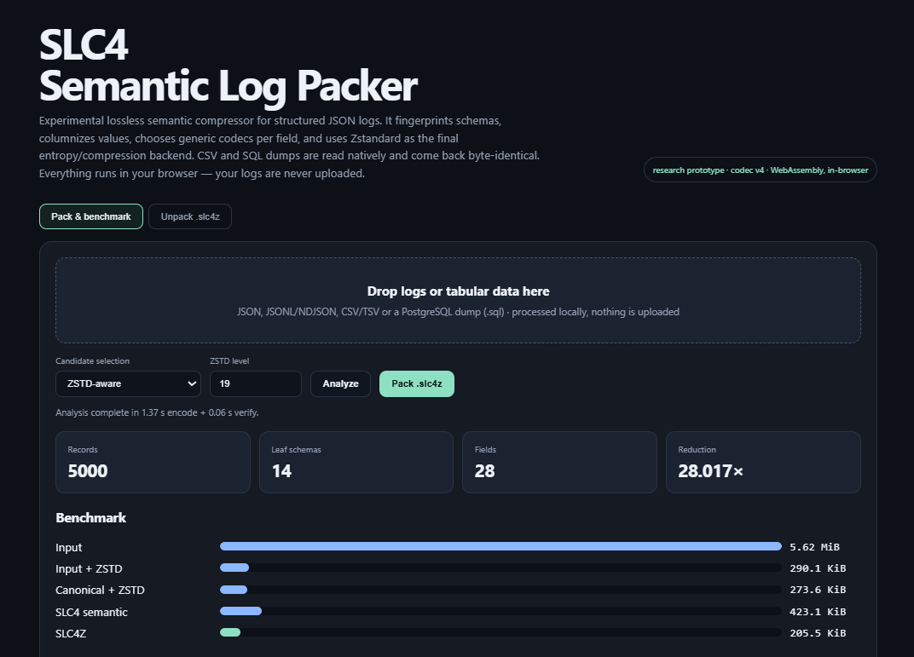

# Streszczenie

Długoterminowa archiwizacja logów aplikacyjnych, infrastrukturalnych i biznesowych jest problemem jednocześnie technicznym i ekonomicznym. Współczesne platformy chmurowe generują logi jako dane półstrukturalne lub strukturalne, najczęściej w JSON, przy czym znaczna część każdego rekordu to powtarzający się szkielet: nazwy pól, identyfikatory zasobu, nazwy usług, poziomy severity, wspólne prefiksy URL-i, formaty timestampów i identyfikatorów. Klasyczne kompresory, takie jak gzip lub Zstandard, widzą przede wszystkim strumień bajtów. Potrafią bardzo skutecznie wykorzystać powtórzenia lokalne, ale nie mają jawnej wiedzy, że ciąg znaków jest timestampem, adresem IPv4, liczbą zapisaną jako tekst, identyfikatorem hex, kolumną kategoryczną albo polem stałym dla tysięcy rekordów.[^zstd]

Niniejszy dokument opisuje drogę od intuicyjnego modelu „ramek” 2D/3D do działającego prototypu semantycznego kodeka logów, roboczo oznaczanego jako SLC4. Główna idea nie polega na zastąpieniu Zstandard własnym algorytmem entropijnym. Zamiast tego log jest najpierw przekształcany z reprezentacji tekstowej do reprezentacji o niższej entropii: wykrywane są schematy rekordów, wartości są grupowane kolumnowo, a dla każdej kolumny dobierany jest jeden z wielu bezstratnych kodeków: stała, dictionary encoding, RLE, bit packing, varint, delta, delta-of-delta, kodowanie timestampów, pakowanie hex, front coding i inne. Dopiero wynik tego etapu podlega kompresji Zstandard.

Kluczową cechą czwartej wersji prototypu jest dobór reprezentacji nie tylko na podstawie rozmiaru formatu pośredniego, lecz także przybliżonego rozmiaru po późniejszej kompresji Zstandard. Eksperyment pokazał, że jest to istotne: na rzeczywistej próbce 5 000 logów Cloud Run wariant minimalizujący surowy strumień semantyczny dawał 386,4 KiB przed ZSTD i 210,6 KiB po ZSTD-19, podczas gdy wariant „ZSTD-aware” tworzył większy strumień pośredni - 437,7 KiB - lecz mniejsze archiwum końcowe: 205,3 KiB. Canonical JSON kompresowany bezpośrednio ZSTD-19 zajmował 273,6 KiB. W tym eksperymencie transformacja semantyczna zmniejszyła więc wynik o około 25,0% względem mocnego baseline'u canonical JSON + ZSTD-19, zachowując pełny semantyczny round-trip 5 000 rekordów.

Przegląd literatury wskazuje jednocześnie, że sam kierunek „wykryj strukturę, rozdziel stałe od zmiennych, koduj typowo i na końcu użyj kompresora ogólnego” ma bogaty prior art. Logzip, CLP, LogLite, DeLog, LogPrism i LogFold rozwijają kolejne warianty strukturalnej kompresji logów.[^logzip][^clp][^loglite][^delog][^logprism][^logfold] Szczególnie LogFold z 2026 r. opisuje macierze sub-tokenów i hybrydowy, zależny od typu dobór kodowania, co jest bliskie części intuicji rozwijanej w niniejszym projekcie.[^logfold] Istnieje też niepeer-reviewowany projekt `logpack`, którego publiczny opis jest funkcjonalnie bardzo zbliżony do kolumnowej kompresji JSON z automatycznym doborem kodowania.[^logpack] Z tego względu dokument nie formułuje twierdzenia o formalnej nowości patentowej. Innowacyjność prototypu należy rozumieć jako konkretną kombinację architektoniczną i hipotezę badawczą: **uniwersalny, niezależny od nazw pól kodek dla heterogenicznego JSON, oparty o rejestr schematów, kolumnowe strumienie typowane i wybór transformacji zoptymalizowany względem końcowego kompresora**.

Druga seria eksperymentów, przeprowadzona na niezależnej implementacji kodeka, potwierdziła te wyniki i doprecyzowała trzy rzeczy. Rozbieżność między implementacjami wyniosła 3,3% w strumieniu pośrednim i 0,1% w archiwum końcowym, co wraz z pomiarem kolumn w reprezentacji zapasowej - 26,3% strumienia pośredniego warte 1,4% archiwum - wskazuje, że strumień pośredni jest słabym predyktorem wyniku i nie powinien służyć do priorytetyzacji prac nad kodekami. Przewaga metody okazała się silnie zależna od rozmiaru porcji, a zależność ta jest funkcją heterogeniczności danych: dla logów wieloschematowych spada z 24,8% do 3,9% przy zejściu z 5 000 do 100 rekordów na porcję, podczas gdy dla jednoschematowego eksportu tabeli relacyjnej utrzymuje się na poziomie 14,7% już przy 1 000 wierszy. Wreszcie sama zasada selekcji świadomej backendu wymaga zaostrzenia: sonda pracująca na innym poziomie kompresji niż kompresja finalna potrafi dawać wyniki gorsze niż brak selekcji.

Wejście rozszerzono następnie o formaty tabelaryczne - CSV oraz zrzuty PostgreSQL - dla których round-trip jest bajtowy, a nie tylko wartościowy. Ten sam zbiór zapisany trzema sposobami daje pliki różniące się dwukrotnie i archiwa mieszczące się w 1,1%, co wskazuje, że rozmiar archiwum jest w przybliżeniu własnością danych, a nie ich reprezentacji wejściowej. Zmierzono również inferencję typów, która pogarsza wynik o 3,1%, ponieważ rozbija jednorodność kolumny; obserwacja ta prowadzi do wniosku, że częściowa normalizacja typów jest gorsza niż żadna.

Domknięto wreszcie brakujący baseline: porównanie z Parquet. Wobec najlepszej z przemiecionych konfiguracji SLC4 jest mniejszy o 6,8% na logach i o 8,4% na tabeli relacyjnej - a więc **jednocyfrowo, nie kilkudziesięcioprocentowo**, jak sugerowały porównania z samym ZSTD. Rozrzut między konfiguracjami samego Parqueta wyniósł przy tym 26%, czyli trzykrotnie więcej niż zmierzona różnica między formatami. Ponieważ Parquet oferuje selektywny odczyt kolumn, którego prototyp nie ma, uczciwym wnioskiem jest, że przewaga rozmiarowa nie jest wystarczającym uzasadnieniem dla nowego formatu; uzasadnienia należy szukać w wierności reprezentacji, której format jednoschematowy zapewnić nie może - co również zostało zmierzone.

**Słowa kluczowe:** kompresja bezstratna, logi, JSON, Zstandard, schema fingerprinting, columnar encoding, dictionary encoding, delta encoding, delta-of-delta, RLE, archiwizacja danych, chunking, dane relacyjne, Cloud Logging.

# Problem i motywacja

## Dlaczego JSON jest wygodny operacyjnie, ale kosztowny archiwizacyjnie

JSON został zaprojektowany jako lekki, tekstowy i przenośny format wymiany danych. Reprezentuje obiekty jako zbiory par nazwa-wartość i pozwala na arbitralne zagnieżdżanie obiektów oraz tablic.[^json] Te cechy są świetne dla interoperacyjności, debugowania i przesyłania danych między systemami, lecz z punktu widzenia archiwizacji tworzą trzy klasy redundancji.

Po pierwsze, **redundancja strukturalna**: nazwy pól są powtarzane przy każdym rekordzie. Jeżeli milion wpisów zawiera `resource.labels.project_id`, `resource.labels.service_name`, `timestamp`, `severity` i `logName`, tekstowe nazwy pojawiają się milion razy mimo że opisują tę samą strukturę.

Po drugie, **redundancja wartości niskiej kardynalności**: poziomy `INFO`, `WARNING`, `ERROR`, nazwy regionów, nazwę jednej usługi lub typ zasobu można zapisać jako kilka bitów indeksu słownikowego zamiast pełnego stringa.

Po trzecie, **nieefektywna reprezentacja semantyczna**. Trace ID zapisany jako 32 znaki hex zajmuje 32 bajty ASCII, mimo że niesie 128 bitów informacji, czyli 16 bajtów. Timestamp RFC 3339 jest czytelny dla człowieka, lecz sekwencja kolejnych timestampów często może być przedstawiona jako wartość bazowa i małe delty. Analogicznie IPv4 może zajmować 4 bajty zamiast 7-15 znaków, a liczby przechowywane jako stringi nie muszą być przechowywane jako cyfry ASCII.

Cloud Logging dobrze ilustruje ten problem. Oficjalny `LogEntry` obejmuje między innymi `logName`, `resource`, `timestamp`, `receiveTimestamp`, `severity`, `insertId`, `httpRequest`, `labels`, `trace`, `spanId` oraz jeden z payloadów: `protoPayload`, `textPayload` lub `jsonPayload`.[^gcp-logentry] Cloud Run tworzy zarówno logi requestów, jak i stdout/stderr oraz logi platformowe, wszystkie osadzone w strukturze `cloud_run_revision`.[^cloudrun-logging] To oznacza, że rzeczywisty eksport logów jest mieszaniną kilku schematów, ale z bardzo dużą częścią wspólnego envelope.

Ekonomiczny sens redukcji bajtów rośnie w warstwie cold/archive, gdzie koszt przechowywania jest niski, ale obowiązują specyficzne zasady retencji i opłaty związane z odczytem. Przykładowo bieżący cennik Google Cloud Storage opisuje dla klasy Archive minimalny okres przechowywania oraz opłaty za retrieval.[^gcs-pricing] Oznacza to, że architektura kodeka powinna być oceniana nie tylko przez ratio, ale także przez koszt CPU kodowania, rozmiar pobieranych danych i oczekiwaną częstotliwość odtworzeń; same ceny usług są parametrem zmiennym i nie są częścią twierdzeń algorytmicznych niniejszego raportu.

## Dlaczego sam Zstandard nie zamyka problemu

Zstandard jest nowoczesnym bezstratnym kompresorem strumieniowym. Format opisany w RFC 8878 wykorzystuje mechanizmy słownikowo-dopasowujące z rodziny LZ oraz kodowanie entropijne; wspiera również zewnętrzne słowniki i pracę strumieniową.[^zstd] Z punktu widzenia praktycznego jest to bardzo mocny baseline dla archiwizacji logów: potrafi odnaleźć powtarzające się sekwencje bajtów, korzystać z szerokich okien i w wysokich poziomach kompresji poświęcić dużo CPU na lepsze wyszukiwanie dopasowań. Współczesny Zstandard obsługuje też long-distance matching; dokumentacja wskazuje, że większe okna mogą poprawiać ratio kosztem pamięci.[^zstd-manual][^zstd-window]

Problem polega na tym, że ZSTD nie otrzymuje informacji: „ta kolumna jest timestampem”, „te 16 znaków to hex o stałej szerokości”, „to pole ma tylko trzy wartości”, „ten URL ma stały host i zmienny path”. Widzi tylko bajty. Część takiej regularności odkryje sam, lecz często dopiero po kosztownym dopasowywaniu lub z gorszą reprezentacją niż kodek świadomy semantyki.

To prowadzi do podstawowej hipotezy projektu:

> **Jeżeli przed Zstandard obniżymy entropię reprezentacji poprzez semantyczną transformację strukturalnych logów, to ZSTD otrzyma strumień łatwiejszy do kompresji niż pierwotny JSON.**

Nie chodzi więc o zastąpienie ZSTD, tylko o zmianę problemu, który ZSTD ma rozwiązać.

# Podstawy teoretyczne

## Entropia i granica bezstratnej kompresji

Klasyczna teoria informacji Shannona formalizuje intuicję, że średnia liczba bitów potrzebna do reprezentacji źródła zależy od rozkładu prawdopodobieństw jego symboli.[^shannon] Dla symbolu o prawdopodobieństwie $p$ idealny koszt informacyjny wynosi:

$$
I(x)=-\log_2 p(x).
$$

Jeżeli wartość `INFO` pojawia się w 90% rekordów, reprezentowanie jej za każdym razem czterema znakami ASCII jest oczywiście nieoptymalne. Podobnie jeżeli kolejne timestampy różnią się zwykle o kilka milisekund, kodowanie pełnego 26-30 znakowego stringa ignoruje silną zależność między sąsiednimi wartościami.

Kompresja bezstratna nie może „magicznie” usunąć informacji losowej. Jeżeli `spanId` jest rzeczywiście losowym 64-bitowym identyfikatorem, to po usunięciu narzutu ASCII pozostanie około 64 bitów niekompresowalnej treści. Celem transformacji semantycznej jest więc nie tyle skompresowanie entropii właściwej, ile **oddzielenie entropii właściwej od narzutu reprezentacyjnego i korelacji, które nie są jawne dla kompresora bajtowego**.

## LZ77, Zstandard i powtórzenia w strumieniu

Lempel i Ziv w 1977 r. przedstawili uniwersalny algorytm kompresji sekwencyjnej oparty na wykorzystywaniu wcześniejszych fragmentów jako odniesień.[^lz77] Intuicja jest prosta: zamiast ponownie przechowywać ciąg, można zapisać odległość do poprzedniego wystąpienia oraz długość dopasowania. W rodzinie LZ reprezentacja może więc wyglądać konceptualnie jak:

```text
literal: "resource.labels."
match:   offset = 847, length = 16
```

Zstandard rozwija tę rodzinę rozwiązań, łącząc wyszukiwanie dopasowań z efektywnym kodowaniem literałów i sekwencji. W implementacji stosowane są między innymi Huffman i Finite State Entropy, wariant ANS.[^zstd][^ans]

Ta siła ZSTD jest jednocześnie powodem, dla którego pierwszy eksperyment z arbitralną geometrią 2D nie przyniósł przewagi: kiedy regularność da się wyrazić jako zwykłe powtórzenie bajtów, ZSTD często odkrywa ją sam bardzo dobrze.

## Dictionary, RLE, delta, front coding i kolumnowość

Wiele technik, które pojawiły się w naszym prototypie, jest klasycznymi elementami formatów kolumnowych. Parquet definiuje między innymi dictionary encoding, hybrydę RLE/bit-packing, `DELTA_BINARY_PACKED`, `DELTA_LENGTH_BYTE_ARRAY` i `DELTA_BYTE_ARRAY` (front compression stringów).[^parquet] Apache Arrow ma jawne reprezentacje dictionary-encoded i run-end encoded oraz przechowuje wartości kolumnowo.[^arrow]

To ważne rozróżnienie: innowacyjność projektu nie może polegać na twierdzeniu, że wynaleziono dictionary lub delta encoding. Są to dojrzałe techniki. Potencjalna wartość leży w **automatycznej kompozycji tych technik dla heterogenicznych logów oraz w sposobie wyboru reprezentacji**.

## Delta-of-delta i dane czasowe

Gorilla, system szeregów czasowych Facebooka, wykorzystał między innymi delta-of-delta dla timestampów i XOR dla wartości zmiennoprzecinkowych, osiągając znaczną redukcję pamięciową dla metryk.[^gorilla] Jeżeli:

```text
T0 = 12:00:00.000
T1 = 12:00:00.100
T2 = 12:00:00.200
T3 = 12:00:00.300
```

pierwsze delty wynoszą `100,100,100`, a drugie delty `0,0`. Taki strumień ma bardzo niską entropię. W logach cloudowych timestampy nie są idealnie okresowe, ale nadal często mają małe i skorelowane odstępy.

# Stan techniki i prior art

## Kompaktowe serializacje binarne

CBOR jest standaryzowaną binarną reprezentacją modelu danych zbliżonego do JSON. Jego cele obejmują niewielki rozmiar wiadomości i prostą, jednoznaczną reprezentację typów binarnych.[^cbor] CBOR usuwa część narzutu tekstowego JSON, np. zapis liczb w ASCII, lecz sam w sobie nie reorganizuje dużej kolekcji rekordów według kolumn i nie wykorzystuje globalnie powtarzalnego schematu w takim stopniu jak format kolumnowy lub kodek logów.

## Formaty kolumnowe

Parquet jest szczególnie istotnym punktem odniesienia, ponieważ stosuje dokładnie wiele z technik, do których doszliśmy eksperymentalnie: słowniki, RLE, bit packing, delty liczbowe i front compression stringów.[^parquet] Jest jednak formatem analitycznym zaprojektowanym przede wszystkim dla tabel i kolumn, z określonym modelem pages/row groups, a jego writers tradycyjnie korzystają z heurystyk wyboru kodowania. W 2025 r. w społeczności Parquet trwała publiczna dyskusja o bardziej dynamicznym wyborze kodowania; wskazywano, że różne implementacje mogą próbować kilku kodowań i wybierać najlepsze.[^parquet-dynamic]

W literaturze bazodanowej podobny problem był badany wcześniej. CodecDB proponował data-driven selection kodowania kolumn, wskazując, że sztywne reguły mogą prowadzić do suboptymalnego ratio.[^codecdb] Z punktu widzenia naszego projektu oznacza to, że **adaptacyjny wybór kodeka per kolumna również ma prior art**.

## Kompresja specyficzna dla logów

### Logzip

Logzip (2019) argumentuje, że kompresory ogólnego przeznaczenia nie wykorzystują w pełni ukrytej struktury logów. Metoda wydobywa struktury przez iteracyjne klastrowanie, tworząc spójne reprezentacje pośrednie, które następnie lepiej poddają się kompresji. Autorzy raportują średnio około połowę przestrzeni wymaganej przez tradycyjne kompresory na badanych zbiorach.[^logzip]

### CLP

CLP (OSDI 2021) idzie dalej: bezstratnie kompresuje nieustrukturyzowane logi tekstowe i zachowuje możliwość efektywnego wyszukiwania w danych skompresowanych. Zysk wynika z wyspecjalizowanego algorytmu wykorzystującego powtarzalność logów.[^clp] CLP pokazuje ważny kierunek projektowy: archiwum logów nie musi być jedynie „plikiem do pełnego rozpakowania”; format może zachować strukturę wspierającą selektywny odczyt.

### LogLite

LogLite (2025) został zaprojektowany jako lekki, plug-and-play, streamingowy kompresor bezstratny dla TEXT i JSON, bez predefiniowanych reguł lub treningu i z adaptacją do ewolucji struktur.[^loglite] Jest to istotnie bliski kierunek dla docelowej uniwersalności naszego kodeka.

### DeLog

DeLog (2026) zwraca uwagę, że dokładność parsera szablonów nie jest tożsama z dobrym ratio. Ważniejsze jest grupowanie danych w zbiory o niskiej entropii i skuteczne kodowanie takich grup.[^delog] To bardzo dobrze zgadza się z doświadczeniem V4: celem nie jest „idealne zrozumienie logu”, lecz znalezienie transformacji, która daje najlepszy koszt końcowy.

### LogPrism

LogPrism (2026) krytykuje klasyczny pipeline „parse-then-compress” i integruje wydobywanie struktury z kodowaniem zmiennych poprzez Unified Redundancy Tree. Autorzy raportują przewagę na większości z 16 benchmarków i podkreślają znaczenie wspólnego modelowania struktury i wartości.[^logprism]

### LogFold

LogFold (ICSE 2026) jest szczególnie bliski naszej początkowej intuicji. Autorzy rozkładają structured tokens na delimiter skeleton i sekwencje sub-tokenów, a następnie układają sub-tokeny w konceptualne macierze kolumnowe. W każdej kolumnie pojawia się homogeniczność typu, długości lub rozkładu, co umożliwia wyspecjalizowane kodowanie.[^logfold] Jest to niemal dokładna naukowa wersja intuicji, że „ramka/macierzy może ujawnić strukturę, której kompresor bajtowy nie widzi”.

### `logpack` - bardzo bliski engineering prior art

W kwietniu 2026 r. publicznie dostępny projekt GitHub `Atomics-hub/logpack` opisywał kolumnową kompresję logów JSON: schema extraction, typed columns, template extraction, type-aware encoding, delta-of-delta dla timestampów, binarne IPv4/UUID/hex i adaptacyjny ZSTD.[^logpack] Jest to bardzo bliski funkcjonalnie prior art dla SLC4. Repozytorium nie jest publikacją peer-reviewed i na moment przeglądu miało minimalne sygnały adopcji, ale z perspektywy roszczenia o „unikalność pomysłu” nie można go ignorować.

## Wniosek z przeglądu literatury

Najważniejszy wniosek jest dwuczęściowy.

Po pierwsze, **problem jest realny i aktywnie badany**. Najnowsza literatura z lat 2025-2026 wręcz przyspiesza w stronę hybrydowych, typowo-zależnych i strukturalnych kodeków logów.

Po drugie, **większość elementów SLC4 nie jest nowa indywidualnie**. Nowości należy szukać w szczegółowej architekturze, kryterium optymalizacji i integracji z heterogenicznym JSON, a nie w samym użyciu słowników, delt czy macierzy.

# Ewolucja pomysłu: od ramki do modelu semantycznego

## Etap 1: ramka 2D i maska zajętości

Pierwotna hipoteza zakładała umieszczanie danych w macierzy dwuwymiarowej i opisywanie struktury przez maskę:

```text
####....
####....
........
........
```

Dla macierzy 4x4 maska wymaga 16 bitów. Jeżeli wiele ramek używa tych samych masek, można przechowywać słownik struktur i zastąpić pełną maskę małym `structure_id`.

To intuicyjnie przypomina dictionary encoding schematu. Kluczowe odkrycie było jednak negatywne: **sama geometria nie tworzy kompresji**. Jeśli każdy znak nadal trzeba przechować, maska jest dodatkowym narzutem. Zysk pojawia się dopiero wtedy, gdy maska/schemat pozwala usunąć powtarzający się opis albo gdy wartości są silnie skorelowane między ramkami.

## Pedagogiczny przykład bitowy

Rozważmy cztery porcje po osiem znaków:

```text
F1 = ABCD1234
F2 = ABCD1235
F3 = ABCD1235
F4 = ABCD1236
```

W ASCII jest to 32 znaki, czyli 256 bitów. Załóżmy dwie możliwe maski 4x4. Słownik dwóch masek kosztuje 32 bity, a cztery identyfikatory masek - 4 bity. Gdyby wartości każdej ramki nadal przechowywać w całości, koszt wzrósłby do 292 bitów: transformacja byłaby gorsza od wejścia.

Jeżeli jednak potraktujemy pierwszą ramkę jako keyframe, a kolejne jako delty w osi Z, uproszczony koszt może wynieść:

- słownik masek: 32 bity,
- ID masek: 4 bity,
- pełne F1: 64 bity,
- delta F2: 15 bitów,
- delta F3: 4 bity,
- delta F4: 15 bitów.

Łącznie: **134 bity zamiast 256**, czyli 47,7% redukcji w tym modelu dydaktycznym. Nie jest to wynik rzeczywistego formatu - pominięto część nagłówków i założono dogodny model delty - ale przykład pokazuje, gdzie naprawdę powstaje zysk: nie z 2D, lecz z zależności między kolejnymi warstwami.

## Etap 2: oś Z jako delta / predictive coding

Trzeci wymiar został zinterpretowany jako ciąg kolejnych rekordów lub snapshotów:

```text
FRAME 1 -> pełny stan
FRAME 2 -> delta względem FRAME 1
FRAME 3 -> delta względem FRAME 2
...
```

To jest bliskie predictive coding i kompresji temporalnej wideo. Natychmiast pojawia się klasyczny kompromis: im dłuższy łańcuch delt, tym lepszy potencjalny ratio, ale gorszy random access. Rozwiązaniem są keyframes/checkpoints.

## Etap 3: reinterpretacja X/Y jako pól i typów

Najważniejsza zmiana koncepcyjna polegała na rezygnacji z fizycznej geometrii znaków. Dla logów naturalna „macierz” jest semantyczna:

```text
                 record 1      record 2      record 3
schema_id            3             3             7
timestamp            T0           +d1           +d2
severity            INFO           =          WARNING
status               200          404           404
service              #2            #2            #2
trace                 X1            X2            X3
```

Oś X/Y reprezentuje pola, typy i komponenty struktury, a oś Z - kolejne rekordy. Każdy „wiersz” otrzymuje własny kodek. W tym momencie koncepcja przestaje być eksperymentem z macierzą, a staje się **adaptacyjnym formatem kolumnowym dla heterogenicznych logów**.

# Architektura SLC4

## Założenia projektowe

Wersja V4 przyjęła pięć kluczowych założeń:

1. brak reguł zależnych od nazwy pola, np. specjalnego kodu dla `trace` czy `latency`;
2. dowolny zagnieżdżony JSON na wejściu;
3. wiele schematów w jednym archiwum;
4. automatyczny dobór kodeka dla kolumny z zestawu kandydatów;
5. pełna rekonstrukcja wartości i typów JSON w tej samej kolejności rekordów.

Nie jest zachowywana nieistotna semantycznie reprezentacja tekstowa: whitespace i kolejność kluczy obiektu JSON. Zgodnie z modelem JSON obiekt jest kolekcją par nazwa-wartość; kolejność członków obiektu nie jest semantycznym kontraktem samego formatu.[^json]

Po dodaniu wejść tabelarycznych (opisanych niżej) kontrakt przestał być jednolity i warto go rozpisać, bo różnica jest merytoryczna, a nie implementacyjna:

| Wejście | Gwarancja round-tripu |
|---|---|
| JSON, JSONL | wartości i kolejność rekordów; bez whitespace i kolejności kluczy |
| CSV, TSV | **bajtowa** |
| zrzut PostgreSQL | **bajtowa** |

Asymetria wynika z natury formatów. JSON ma model danych, w którym kolejność kluczy nie jest znacząca, więc jej odtwarzanie byłoby przechowywaniem informacji bez treści. CSV i zrzut SQL to natomiast pliki tekstowe bez modelu danych ponad tekstem: tam każdy bajt jest treścią, a jedyną uczciwą gwarancją jest gwarancja bajtowa.

## Krok 0: warstwa wejścia

Pierwotnie kodek przyjmował wyłącznie JSON. Ograniczenie to okazało się kłopotliwe przy danych relacyjnych: systemy zarządzanych baz danych eksportują do magazynu obiektowego zrzut SQL albo CSV, nie JSON, więc każde porównanie musiałoby przechodzić przez sztuczny etap konwersji, który sam zmienia reprezentację i zaciemnia wynik. Dodano zatem czytniki obu formatów.

### Wartości tabelaryczne są czytane jako tekst

CSV i format tekstowy COPY nie mają systemu typów - wszystko jest w nich ciągiem znaków. Naturalną pokusą jest inferencja typu, czyli zamiana `"123"` na liczbę. Przyjęto rozwiązanie odwrotne: **wartości pozostają tekstem**, a inferencja jest opcją wyłączoną domyślnie.

Uzasadnienie jest dwuczęściowe. Po pierwsze, inferencja jest stratna względem zapisu: `"0042"` wróciłoby jako `42`, a `"1.50"` jako `1.5`, co dla eksportu bazy danych jest zmianą treści, nie formy. Po drugie - i to jest argument właściwy - **kodek już potrafi kodować liczby zapisane jako tekst**: kodeki `uintstr` i `numtemplate` zamieniają takie kolumny na strumienie liczb całkowitych. Zachowanie tekstu kosztuje więc znacznie mniej, niż sugeruje intuicja. Eksperyment H mierzy ten koszt i pokazuje, że jest ujemny: inferencja powiększa archiwum.

### Zrzut SQL jako sekwencja segmentów

Zrzut bazy nie jest tabelą. Jest to DDL, ustawienia sesji, definicje sekwencji i uprawnień, pomiędzy którymi znajdują się bloki danych. Czytnik dzieli plik na dwa rodzaje segmentów:

```text
[ literal  ]  komentarze, SET, CREATE TABLE, ALTER, CREATE INDEX ...
[ dane     ]  COPY ... FROM stdin;  albo pojedyncze INSERT
[ literal  ]  ...
```

Segmenty danych trafiają do kolumn, segmenty literalne są przechowywane dosłownie. Daje to własność, którą warto nazwać wprost: **konstrukcje, których kodek nie modeluje, degradują się do tekstu, nigdy do utraty danych**. Zrzut używający składni spoza obsługiwanego podzbioru - na przykład wielowierszowego `INSERT ... VALUES (...),(...)` w stylu MySQL - zostanie zarchiwizowany bez transformacji semantycznej, ale nadal odtworzy się bajtowo. Kompresja degraduje się wtedy do samego ZSTD, co jest dokładnie tym, co dostalibyśmy bez kodeka.

Zrzut z wieloma tabelami jest przy okazji naturalnym zastosowaniem rejestru schematów: każda tabela wnosi własny zestaw ścieżek liściowych i staje się osobnym schematem w tym samym archiwum.

## Krok 1: flattening i fingerprint schematu

Każdy rekord jest rozkładany do ścieżek liściowych:

```text
resource.type
resource.labels.project_id
resource.labels.service_name
httpRequest.requestMethod
httpRequest.status
...
```

Sygnaturą schematu jest uporządkowany zbiór ścieżek obecnych w rekordzie. Każdy unikalny zbiór otrzymuje `schema_id`. Dzięki temu struktura nie jest powtarzana przy każdym rekordzie.

Dla badanej próbki Cloud Run 5 000 rekordów wygenerowało tylko **14 unikalnych schematów liściowych** i **28 globalnych ścieżek liściowych**. To silnie potwierdza hipotezę, że heterogeniczny eksport Cloud Logging ma niewielką liczbę powtarzalnych szkieletów.

## Krok 2: kolumnizacja

Dla każdej ścieżki liściowej budowany jest strumień wartości tylko z rekordów, w których pole występuje. Schemat rekordu mówi później dekoderowi, które kolumny należy odczytać przy rekonstrukcji danego obiektu.

W efekcie wartości tego samego rodzaju trafiają obok siebie:

```text
severity: INFO INFO WARNING INFO ...
status:   200  404  404     200  ...
timestamp: ...
spanId:   ...
```

To ujawnia regularności, które w row-oriented JSON są rozdzielone setkami bajtów innych pól.

## Krok 3: zestaw kandydatów kodowania

V4 testuje zależnie od typu między innymi:

| Klasa danych | Kandydaci |
|---|---|
| bool | bit-pack |
| integer | varint, delta, delta-of-delta, dictionary, RLE |
| timestamp-like string | integer nanoseconds + delta / delta-of-delta |
| decimal integer string | integer varint / delta |
| string z jednym tokenem liczbowym | numeric-template + mantissa/scale |
| IPv4 | 4 bajty binarne |
| fixed-width hex | pakowanie 2 znaki hex -> 1 bajt |
| string low-cardinality | dictionary + bit-packed IDs |
| string z długimi runami | RLE |
| string z wspólnym prefiksem | prefix stripping |
| lokalnie podobne stringi | front coding |
| pozostałe | raw UTF-8 lub MessagePack fallback |

Takie podejście jest zbieżne z ideą hybrid encoding w LogFold oraz z technikami Parquet/Arrow, ale zastosowane jest do dynamicznych kolumn wyprowadzonych automatycznie z JSON.[^parquet][^logfold]

## Krok 4: adaptacyjny wybór kodeka

Najprostszy selektor wybiera:

$$
e^*=\arg\min_e |C_e(x)|,
$$

gdzie $C_e$ jest kandydatem kodowania. Eksperyment V4 pokazał jednak, że to nie jest właściwa funkcja celu, jeśli archiwum i tak będzie później kompresowane ZSTD.

Docelowy cel powinien być bliższy:

$$
e^*=\arg\min_e |ZSTD(C_e(x),m_e)|,
$$

gdzie $m_e$ oznacza metadane potrzebne do odtworzenia kodowania.

W prototypie wykorzystano tani wariant „oracle-lite”: każdy kandydat wraz z metadanymi jest próbnie kompresowany ZSTD-1, a zwycięzca jest wybierany na podstawie rozmiaru tej próbki. Całe archiwum jest następnie kompresowane ZSTD-19. To heurystyka, nie formalnie optymalny algorytm, ale realny benchmark potwierdził jej sens.

## Krok 5: warstwa archiwum i ZSTD

Format pośredni składa się z:

```text
SLC4 magic/version
metadata (MessagePack)
  - lista globalnych ścieżek
  - rejestr schematów
  - sposób kodowania schema_id
  - metadata każdej kolumny
schema-id stream
column payloads
```

Następnie cały strumień jest kompresowany ZSTD. Architektura jest celowo dwuwarstwowa:

```text
JSON
  |
  v
semantic normalization / schema / columns
  |
  v
per-column encoding
  |
  v
SLC4 intermediate stream
  |
  v
ZSTD
  |
  v
archive
```

To rozdziela dwa rodzaje redundancji: semantyczną i bajtową.

# Eksperymenty

## Metodologia

Wyniki opisane poniżej zostały odtworzone na kodzie prototypów zapisanych podczas prac. Wszystkie testy bezstratne kończyły się sprawdzeniem round-trip. Dla V4 kryterium było równoważne:

```python
decoded == original
```

na poziomie obiektów JSON/Python. Benchmarki ZSTD wykonano programem `zstd` w wersji dostępnej w środowisku testowym; prototyp raportował poziomy `-3`, `-9` i `-19`.

Należy podkreślić, że są to **eksperymenty eksploracyjne**, a nie publikacyjny benchmark wydajności: jeden host, małe zbiory, implementacja Python i brak kontrolowanej serii powtórzeń. Wyniki rozmiarowe są użyteczne, ale czasy nie powinny być interpretowane jako docelowy throughput produkcyjnego kodeka. Baseline Parquet w eksperymencie I liczono biblioteką `pyarrow` 25.0.1, z kompresją ZSTD na tym samym poziomie 19 i jedną grupą wierszy, aby obie strony pracowały na pełnym kontekście.

### Dwie implementacje i wrażliwość wyników na build ZSTD

Eksperymenty D-G zostały wykonane na drugiej, niezależnej implementacji kodeka w JavaScripcie. Ten sam plik źródłowy wykonuje się w Node i w przeglądarce, a backend ZSTD jest wstrzykiwany: `node:zlib` po stronie Node, WebAssembly po stronie przeglądarki. Pozwala to rozdzielić dwa źródła zmienności, które w pojedynczej implementacji są ze sobą splecione.

Okazało się to istotne metodologicznie. **Strumień semantyczny SLC4 jest deterministyczny** - przy tych samych danych i tym samym trybie selekcji oba backendy produkują bajtowo identyczny strumień pośredni i identyczny wybór kodeków. Różni się natomiast końcowa ramka ZSTD, ponieważ biblioteki zstd w Node i w użytym buildzie WebAssembly są w różnych wersjach: dla ZSTD-19 na tym samym 433 235-bajtowym strumieniu dało to 210 780 B wobec 210 438 B, czyli 0,16%.

Wynika z tego zalecenie dla każdego przyszłego benchmarku: **rozmiar archiwum końcowego jest odtwarzalny z dokładnością do ułamka procenta wyłącznie w obrębie tej samej wersji biblioteki zstd**. Porównania między systemami powinny albo jawnie raportować wersję backendu, albo odnosić się do strumienia semantycznego, który takiej zmienności nie ma. Nie unieważnia to wcześniejszych liczb, ale wyznacza próg, poniżej którego różnica między dwoma kodekami nie jest sygnałem.

## Eksperyment A: arbitralna ramka 2D na zwykłym tekście

Pierwszy prototyp pakował powtarzalny JSON/tekst bezpośrednio do ramek 2D. Wynik był jednoznacznie negatywny:

| Reprezentacja | Rozmiar | % baseline |
|---|---:|---:|
| wejście | 5,01 MiB | 100% |
| frame codec | 9,81 MiB | 196,02% |
| ZSTD-3 na wejściu | 51,64 KiB | 1,01% |
| ZSTD-19 na wejściu | 19,07 KiB | 0,37% |
| ZSTD-3 po frame codec | 256,81 KiB | 5,01% |
| ZSTD-19 po frame codec | 54,58 KiB | 1,06% |

Wniosek: **arbitralna geometria 2D szkodzi**, jeżeli nie ujawnia nowej regularności. Powtarzalny tekst jest idealnym materiałem dla LZ/ZSTD i narzut ramek jedynie zaburza lokalność bajtów.

## Eksperyment B: wolno zmieniające się snapshoty 32x32

Drugi test używał 20 000 ramek 32x32, czterech unikalnych masek i 3 840 000 zajętych wartości. Między kolejnymi snapshotami wystąpiło 60 265 zmian.

| Reprezentacja | Rozmiar | % baseline |
|---|---:|---:|
| naive mask + values | 6,10 MiB | 100% |
| frame codec | 144,81 KiB | 2,32% |
| ZSTD-3 naive | 115,77 KiB | 1,85% |
| ZSTD-19 naive | 131,64 KiB | 2,11% |
| ZSTD-3 frame codec | 116,31 KiB | 1,86% |
| ZSTD-19 frame codec | 116,41 KiB | 1,86% |

Frame codec osiągnął około 43x redukcji względem naiwnej reprezentacji, ale **ZSTD-3 na naiwnej reprezentacji był nawet nieco mniejszy**. To ważny wynik naukowy: jawna delta nie jest automatycznie lepsza od dobrego kompresora słownikowego, jeżeli kompresor już widzi silną lokalną redundancję.

## Eksperyment C: rzeczywista próbka Cloud Run

### Charakterystyka zbioru

Badany plik miał **5 895 862 bajtów (5,62 MiB)** i zawierał **5 000 rekordów**. Rozkład strumieni:

- 4 005 rekordów `run.googleapis.com/requests`,
- 744 rekordy `run.googleapis.com/stdout`,
- 251 rekordów `run.googleapis.com/varlog/system`.

Dla 995 rekordów zawierających `textPayload` występowało jedynie **9 unikalnych wartości**. W całym zbiorze wykryto **14 schematów liściowych** i 28 globalnych pól liściowych. To bardzo korzystny profil dla dictionary encoding i schema IDs.

### V3: semantyczny kodek domenowy

V3 wykorzystywał jeszcze więcej wiedzy o charakterze logów. Rezultat:

| Reprezentacja | Rozmiar | % wejścia |
|---|---:|---:|
| original JSON | 5,62 MiB | 100% |
| canonical JSON | 4,61 MiB | 81,90% |
| semantic V3 | 517,6 KiB | 8,99% |
| original + ZSTD-19 | 290,1 KiB | 5,04% |
| canonical + ZSTD-19 | 273,6 KiB | 4,75% |
| **V3 + ZSTD-19** | **207,3 KiB** | **3,60%** |

V3+ZSTD-19 był o około **24,3% mniejszy** niż canonical JSON+ZSTD-19.

### V4: kodek uniwersalny, bez zależności od nazw pól

V4 wybierał kodowanie wyłącznie na podstawie typu i statystyki kolumny. W trybie wyboru zoptymalizowanym pod końcowe ZSTD wybrał następujące klasy kodowania:

```text
const=9
strdict=4
strrle=3
front=2
uintstr=2
hex=2
timestamp=2
numtemplate=1
strraw=1
intdict=1
prefix_hex=1
```

Round-trip wszystkich 5 000 rekordów zakończył się powodzeniem.

| Reprezentacja | Rozmiar | % wejścia |
|---|---:|---:|
| original JSON | 5,62 MiB | 100% |
| canonical JSON | 4,61 MiB | 81,90% |
| V4 semantic, ZSTD-aware selection | 437,7 KiB | 7,60% |
| original + ZSTD-3 | 423,6 KiB | 7,36% |
| canonical + ZSTD-3 | 349,0 KiB | 6,06% |
| V4 + ZSTD-3 | 217,2 KiB | 3,77% |
| original + ZSTD-19 | 290,1 KiB | 5,04% |
| canonical + ZSTD-19 | 273,6 KiB | 4,75% |
| **V4 + ZSTD-19** | **205,3 KiB** | **3,57%** |

Wynik końcowy odpowiada około **28,0x redukcji względem oryginalnego eksportu JSON** i jest o około **25,0% mniejszy od canonical JSON + ZSTD-19**.



### Dlaczego „mniejszy intermediate” nie znaczy „mniejsze archiwum”

To jeden z najciekawszych rezultatów całej serii. V4 uruchomiony z funkcją celu minimalizującą wyłącznie surowy format pośredni osiągnął:

- SLC4: 386,4 KiB,
- SLC4 + ZSTD-19: 210,6 KiB.

Wariant ZSTD-aware:

- SLC4: 437,7 KiB,
- SLC4 + ZSTD-19: 205,3 KiB.

Strumień pośredni był więc o ponad 50 KiB większy, a końcowe archiwum o 5,3 KiB mniejsze. Wyjaśnienie jest intuicyjne: niektóre transformacje usuwają redundancję w sposób, który sam w sobie zmniejsza payload, ale jednocześnie tworzy mniej regularny strumień dla ZSTD. Inne pozostawiają pewną „tanią redundancję”, którą backend kompresuje bardzo skutecznie.

To uzasadnia projektowanie selektora **w kontekście konkretnego backendu**, a nie niezależnie od niego.

### Wyniki dla trzech klas logów osobno

| Klasa | Liczba | canonical + ZSTD-19 | V4 + ZSTD-19 | poprawa |
|---|---:|---:|---:|---:|
| request logs | 4 005 | 248,5 KiB | 194,9 KiB | 21,6% |
| stdout | 744 | 24,9 KiB | 20,8 KiB | 16,7% |
| system | 251 | 17,9 KiB | 16,9 KiB | 5,7% |

Nie każda klasa korzysta więc w tym samym stopniu. Największy efekt pojawia się tam, gdzie struktura i typy są bogate oraz powtarzalne. Logi systemowe z krótkimi, stosunkowo niejednorodnymi komunikatami zostawiają mniej semantycznej redundancji do wykorzystania.

Co ciekawe, wspólne archiwum wszystkich klas jest mniejsze niż suma trzech osobnych archiwów. To sugeruje, że warto zachować możliwość wykorzystywania wspólnych elementów - zasobu, identyfikatorów usługi, namespace'u, regionu itp. - ponad granicami pojedynczego rodzaju logu.

Obserwacja ta wraca w eksperymencie E w postaci ilościowej: jest to ten sam mechanizm, który decyduje o koszcie porcjowania strumienia.

## Eksperyment D: reprodukcja w niezależnej implementacji

Przeniesienie kodeka na drugą implementację dało okazję do sprawdzenia, czy wyniki z eksperymentu C są własnością metody, czy artefaktem konkretnego kodu. Kryterium przyjęto mocniejsze niż round-trip: archiwa nowej implementacji musiały mieć **identyczną sumę SHA-256** co archiwa poprzedniej, dla obu trybów selekcji i poziomów ZSTD 3 i 19, a dodatkowo archiwa jednej implementacji musiały otwierać się w drugiej.

Ta sama próbka Cloud Run, przeliczona w całości po stronie przeglądarki:

| Reprezentacja | V4 (raport, Python) | Implementacja przeglądarkowa |
|---|---:|---:|
| original + ZSTD-19 | 290,1 KiB | 290,1 KiB |
| canonical + ZSTD-19 | 273,6 KiB | 273,6 KiB |
| **SLC4 + ZSTD-19** | **205,3 KiB** | **205,5 KiB** |

Liczba rekordów, schematów liściowych i pól odtworzyła się dokładnie: 5 000 / 14 / 28. Round-trip wszystkich 5 000 rekordów potwierdzony semantycznie.

Interesujący jest jednak nie sam fakt reprodukcji, lecz rozkład różnic. Strumień pośredni obu implementacji **nie jest** identyczny: 423,1 KiB wobec 437,7 KiB, czyli o 3,3% mniej, ponieważ selektor w nowej implementacji rozstrzygnął jedną kolumnę na korzyść `strdict` tam, gdzie poprzednia wybrała `strraw`. Mimo to archiwum końcowe wyszło o 0,1% **większe**.

Jest to niezależne potwierdzenie obserwacji z sekcji o „mniejszym intermediate", tym razem uzyskane przypadkiem, a nie przez celową zmianę funkcji celu. Dwie implementacje tej samej metody, różniące się jedną decyzją kodowania, rozeszły się w strumieniu pośrednim o 3,3% i zbiegły w archiwum do 0,1%. Wzmacnia to tezę, że **strumień pośredni jest słabym predyktorem wyniku końcowego** i nie powinien być używany jako miara jakości kodeka.

## Eksperyment E: koszt porcjowania strumienia

Archiwizacja „w locie" wymaga porcjowania: kodek jest wsadowy, więc strumień trzeba buforować do porcji i dopiero ją kodować. Pytanie brzmi, ile taka decyzja kosztuje. Próbkę 5 000 rekordów Cloud Run podzielono na porcje o różnym rozmiarze, kodując każdą niezależnie i sumując archiwa. Baseline `canonical + ZSTD-19` porcjowano tak samo, aby porównanie było uczciwe - cięcie szkodzi obu stronom.

| Porcja | Porcji | SLC4Z suma | Narzut | canonical + ZSTD suma | SLC4 lepszy o |
|---:|---:|---:|---:|---:|---:|
| 100 | 50 | 322,7 KiB | +56,8% | 335,7 KiB | **3,9%** |
| 250 | 20 | 267,4 KiB | +29,9% | 306,1 KiB | 12,6% |
| 500 | 10 | 240,3 KiB | +16,7% | 293,4 KiB | 18,1% |
| 1 000 | 5 | 225,4 KiB | +9,5% | 284,5 KiB | 20,8% |
| 2 500 | 2 | 211,3 KiB | +2,6% | 276,6 KiB | 23,6% |
| 5 000 | 1 | 205,9 KiB | - | 273,6 KiB | 24,8% |

Wiersz dla jednej porcji (205,9 KiB) różni się o 0,4 KiB od wartości podanej w eksperymencie D, ponieważ nagłówek archiwum przechowuje nazwę pliku źródłowego, a w tym przebiegu była ona inna. Różnica ta jest stała i nie wpływa na porównania wewnątrz tabeli; odnotowujemy ją, bo jest dobrym przypomnieniem, że przy tej skali efektów nawet metadane kontenera są widoczne w wyniku.

Wynik jest jednoznaczny i ma bezpośrednie konsekwencje projektowe: **przewaga transformacji semantycznej degraduje się szybciej niż przewaga samego ZSTD**. Przy 100 rekordach na porcję SLC4 wyprzedza ZSTD o 3,9%, czyli praktycznie o tyle, ile wynosi szum pomiarowy z sekcji o wrażliwości na build. Poniżej tego progu kodek przestaje mieć uzasadnienie.

Przyczyna jest strukturalna. Rejestr schematów, tablica ścieżek i metadane kolumn to koszt w przybliżeniu stały na porcję, a słowniki, front coding i RLE potrzebują dostatecznie wielu wartości w kolumnie, żeby się zamortyzować. Czas kodowania przy tym nie rośnie - pozostawał w przedziale 0,8-1,3 s niezależnie od podziału - więc ograniczeniem jest reprezentacja, nie CPU.

Dla badanego profilu logów **próg opłacalności leży w okolicy 500-1 000 rekordów na porcję**, a nasycenie osiąga się przy kilku tysiącach. Nie jest to stała uniwersalna; jest to funkcja liczby schematów i pól, co eksperyment F pokazuje wprost.

## Eksperyment F: dane relacyjne zamiast logów

Wszystkie dotychczasowe pomiary dotyczyły logów, czyli danych heterogenicznych z wieloma schematami. Naturalne pytanie brzmi, czy metoda przenosi się na eksport tabeli z bazy relacyjnej, gdzie schemat jest dokładnie jeden.

Zbiór jest **syntetyczny** i to ograniczenie należy traktować poważnie: modeluje tabelę zamówień (50 000 wierszy, JSONL, 20,86 MiB) z kolumnami typowymi dla danych transakcyjnych - `bigserial`, UUID, dwa `timestamptz`, klucz obcy, kolumny enumeratywne, `numeric(12,2)`, `double precision`, `boolean`, adres IP, adres e-mail, kolumna tekstowa dopuszczająca NULL oraz `jsonb`. Zbadano dwa warianty eksportu: z NULL-ami zapisanymi jawnie i z pominiętymi.

Do baseline'ów dołączono CSV, ponieważ dla płaskiej tabeli jest to konkurent realny, a nie teoretyczny.

Wariant z NULL-ami jawnymi:

| Reprezentacja | Rozmiar |
|---|---:|
| JSONL | 21 358,8 KiB |
| JSONL + ZSTD-19 | 3 212,9 KiB |
| CSV | 11 661,8 KiB |
| CSV + ZSTD-19 | 3 105,5 KiB |

| Porcja | SLC4Z suma | vs JSONL+ZSTD | vs CSV+ZSTD |
|---:|---:|---:|---:|
| 1 000 | 2 741,3 KiB | -14,7% | -11,7% |
| **10 000** | **2 467,3 KiB** | **-23,2%** | **-20,5%** |
| 50 000 | 2 351,5 KiB | -26,8% | -24,3% |

Wariant z NULL-ami pominiętymi zachowuje się niemal identycznie (-14,3% / -23,3% / -26,8% względem JSONL+ZSTD), przy czym pominięcie NULL-i pozwala kolumnie tekstowej opuścić fallback, bo przestaje być kolumną typu mieszanego.

Dwa wnioski.

Po pierwsze, **metoda przenosi się na dane relacyjne** i utrzymuje przewagę nie tylko nad JSONL+ZSTD, ale też nad CSV+ZSTD, czyli nad reprezentacją, która już usunęła całą redundancję nazw pól.

Po drugie, i to jest wynik ciekawszy, **dane jednoschematowe znoszą porcjowanie znacznie lepiej niż logi**. Przy 1 000 wierszy na porcję przewaga wynosi wciąż 14,7%, podczas gdy w eksperymencie E przy 100 rekordach spadła do 3,9%. Mechanizm jest ten sam, który opisano wyżej: tabela ma jeden schemat i stałą listę ścieżek, więc metadane porcji są małe i nie rosną. Zestawienie eksperymentów E i F sugeruje regułę praktyczną: **minimalny sensowny rozmiar porcji skaluje się z heterogenicznością danych, a nie z ich objętością**.

### Ile naprawdę kosztują kolumny w fallbacku

Diagnostyka kolumn pokazała, że `score` (`double precision`), `amount` (`numeric`), `tax_rate` (`numeric`) oraz `notes` (tekst dopuszczający NULL) trafiają do fallbacku na MessagePack i zajmują 26,3% strumienia semantycznego. Sugerowałoby to, że brak kodeka dla liczb zmiennoprzecinkowych jest największą luką funkcjonalną. Pomiar tego nie potwierdza.

Na porcji 10 000 wierszy, po ZSTD-19:

| Wariant | Archiwum | Zmiana |
|---|---:|---:|
| jak jest | 488,5 KiB | - |
| UUID bez myślników, czyli kodek `hex` zamiast `strraw` | 442,4 KiB | **-9,4%** |
| kwoty jako stringi, czyli `numtemplate`/`strdict` zamiast fallbacku | 481,5 KiB | -1,4% |
| oba naraz | 431,9 KiB | -11,6% |

Kolumny zmiennoprzecinkowe, zajmujące ponad jedną czwartą strumienia pośredniego, są warte **1,4%** archiwum, ponieważ ZSTD radzi sobie z blobami MessagePacka lepiej, niż sugerowałby ich rozmiar. Realna luka leży gdzie indziej: kodek `hex` wymaga jednolitego ciągu szesnastkowego o stałej szerokości, a myślniki w UUID go dyskwalifikują, przez co 36-znakowy tekst idzie jako `strraw`. Uogólnienie tego kodeka na wzorce ze stałymi separatorami jest warte **9,4%**, a klucze zastępcze w postaci UUID występują w bazach powszechnie.

Jest to trzecie w tym dokumencie wystąpienie tej samej zasady, tym razem w formie odwróconej: reprezentacja, która w strumieniu pośrednim wygląda na kosztowną, może być tania po kompresji. **Priorytetyzacja prac nad kodekami musi opierać się na pomiarze archiwum, nie na profilu strumienia pośredniego.**

## Eksperyment G: selektor jest świadomy backendu, ale nie jego punktu pracy

Sekcja o kroku 4 architektury opisuje selektor, który ocenia kandydatów po ich rozmiarze po kompresji ZSTD. W implementacji próbna kompresja wykonywana jest zawsze na poziomie ZSTD-1, niezależnie od poziomu, którym archiwum zostanie ostatecznie spakowane. Pomiar na próbce Cloud Run pokazuje, że nie jest to obojętne:

| Poziom finalny | Selekcja `raw` | Selekcja ZSTD-aware |
|---|---:|---:|
| ZSTD-3 | **226,2 KiB** | 226,6 KiB |
| ZSTD-19 | 211,3 KiB | **205,8 KiB** |

Przy poziomie 19 selekcja świadoma backendu wygrywa o 2,6%, zgodnie z tezą dokumentu. Przy poziomie 3 **przegrywa z brakiem selekcji**, choć o niewiele. Innymi słowy: sonda na poziomie 1 jest dobrym przybliżeniem zachowania ZSTD-19, a gorszym przybliżeniem zachowania ZSTD-3, mimo że numerycznie jest do niego bliżej.

Wynik ten nie podważa tezy o selekcji z backendem w pętli - raczej ją zaostrza. Backend to nie tylko algorytm, lecz algorytm **w konkretnym punkcie pracy**, a rozbieżność między punktem pracy sondy a punktem pracy kompresji finalnej może skasować cały zysk z selekcji. Jest to bezpośrednia hipoteza do sfalsyfikowania: czy sonda na poziomie równym poziomowi finalnemu poprawia wynik na tyle, by uzasadnić swój koszt CPU.

## Eksperyment H: ta sama tabela w trzech reprezentacjach

Dodanie czytników CSV i SQL pozwoliło zadać pytanie, którego wcześniej nie dało się postawić czysto: **ile z wyniku zależy od danych, a ile od formatu, w którym zostały wyeksportowane?** Ten sam zbiór 50 000 wierszy z eksperymentu F zapisano trzema sposobami - jako CSV z nagłówkiem, jako zrzut `pg_dump` z blokiem COPY i pełnym DDL, oraz jako JSONL. Każdy z nich porównano z jego własnym baseline'em, czyli tym samym plikiem po ZSTD-19.

| Format | Oryginał | + ZSTD-19 | SLC4Z | SLC4Z lepszy o | Round-trip |
|---|---:|---:|---:|---:|---|
| CSV | 9,15 MiB | 2 995,9 KiB | 2 287,0 KiB | 23,7% | bajtowy |
| Zrzut SQL | 9,22 MiB | 3 000,6 KiB | 2 306,0 KiB | 23,1% | bajtowy |
| JSONL | 19,33 MiB | 3 146,4 KiB | 2 280,5 KiB | 27,5% | wartości |

Przewaga utrzymuje się w każdej reprezentacji, w tym nad CSV+ZSTD, czyli nad formatem, który sam z siebie usunął już całą redundancję nazw pól. Interesujący jest jednak rozkład, a nie sam fakt.

**Pliki wejściowe różnią się dwukrotnie, archiwa mieszczą się w 1,1%.** JSONL jest ponad dwa razy większy od CSV, a jego baseline po ZSTD wciąż o 5% większy; po transformacji semantycznej wszystkie trzy zbiegają w przedział 2 280-2 306 KiB. Sugeruje to, że **rozmiar archiwum jest w przybliżeniu własnością danych, a nie sposobu ich zapisania** - czego można oczekiwać od kodeka, który normalizuje reprezentację, ale co warto było zmierzyć, a nie założyć.

Sformułowanie „w przybliżeniu" jest tu konieczne z dwóch powodów, i oba są pouczające.

Po pierwsze, **te trzy pliki nie są semantycznie identyczne**. CSV nie odróżnia wartości NULL od pustego łańcucha, więc kolumna `notes` jest w nim jednorodnie tekstowa, podczas gdy w zrzucie SQL i w JSONL zawiera wartości puste obok tekstu. Konsekwencja jest widoczna w diagnostyce kolumn:

| Kolumna | CSV | Zrzut SQL |
|---|---|---|
| `notes` | `front`, 341,7 KiB | `msgpack`, 350,0 KiB |

Kolumna typu mieszanego wpada w reprezentację zapasową, jednorodna dostaje front coding. **Format mniej wyrazisty skompresował się lepiej właśnie dlatego, że jest mniej wyrazisty** - utrata rozróżnienia NULL od pustego napisu przypadkiem uchroniła kolumnę przed fallbackiem. Jest to ta sama słabość, którą eksperyment F odnotował dla kolumn dopuszczających NULL, tu obserwowana z drugiej strony.

Po drugie, zrzut SQL niesie DDL, którego pozostałe reprezentacje nie mają. Okazało się to jednak nieistotne ilościowo: segmenty literalne to 905 B tekstu, po ZSTD-19 477 B, wobec 19 KiB różnicy między archiwum SQL a CSV. **Za różnicę odpowiada reprezentacja wartości, nie obecność DDL.**

### Inferencja typów pogarsza wynik

Decyzja o czytaniu wartości tabelarycznych jako tekstu została opisana w architekturze jako uzasadniona tym, że kodeki `uintstr` i `numtemplate` już kodują liczby zapisane tekstem. Twierdzenie to należało sprawdzić, ponieważ jest falsyfikowalne.

| Tryb | Strumień semantyczny | SLC4Z |
|---|---:|---:|
| wartości jako tekst (domyślnie) | 5 319,0 KiB | **2 287,0 KiB** |
| z inferencją typów | 5 882,4 KiB | 2 358,9 KiB |

Inferencja **powiększyła archiwum o 3,1%**, a strumień pośredni o 10,6%. Mechanizm jest widoczny w kolumnach:

| Kolumna | Tekst | Z inferencją |
|---|---|---|
| `amount` (`numeric(12,2)`) | `numtemplate`, 151,8 KiB | `msgpack`, 433,4 KiB |
| `score` (`double precision`) | `numtemplate`, 152,2 KiB | `msgpack`, 434,1 KiB |

Przyczyną nie jest słabość inferencji, lecz jej **niekompletność**. Konwersja jest zachowawcza: zamienia wartość na liczbę tylko wtedy, gdy wypisanie tej liczby daje dokładnie ten sam tekst. Dla kolumny kwotowej oznacza to, że `"3400.45"` staje się liczbą, a `"1000.00"` pozostaje tekstem, bo `1000` to inny zapis niż `1000.00`. Kolumna, dotąd jednorodnie tekstowa, staje się mieszana - i trafia do reprezentacji zapasowej, która kosztuje prawie trzykrotnie więcej.

Wniosek jest ogólniejszy niż ta jedna flaga: **częściowa normalizacja typów jest gorsza niż żadna**. Wartość kolumnowej reprezentacji bierze się z jednorodności, więc transformacja, która poprawia typ części wartości, może zniszczyć własność, na której opiera się cały zysk. Jest to argument za tym, żeby ewentualny przyszły kodek liczb zmiennoprzecinkowych operował na całej kolumnie naraz, a nie na wartościach pojedynczo.

## Eksperyment I: baseline Parquet

Brak porównania z Parquet był w poprzednich wersjach tego dokumentu wskazywany jako główna luka - i słusznie, ponieważ Parquet implementuje dokładnie te techniki, do których prototyp doszedł niezależnie: słowniki, RLE, bit packing, delty liczbowe i front coding stringów.[^parquet] Po dodaniu czytników CSV i zrzutów SQL porównanie dało się przeprowadzić bez sztucznej konwersji przez JSON, więc lukę zamknięto.

Wynik jest istotnie mniej korzystny dla SLC4 niż wskazywałyby wcześniejsze porównania z samym ZSTD, i to jest najważniejsza rzecz, którą ten eksperyment wnosi.

### Metodologia i zasada uczciwości

Użyto `pyarrow` 25.0.1. Parquet ustawiono tak, aby wypadł jak najlepiej: ZSTD na tym samym poziomie 19 co SLC4, jedna grupa wierszy (odpowiednik jednej porcji SLC4, więc obie strony korzystają z pełnego kontekstu), słowniki włączone tam, gdzie pomagają.

Przyjęto przy tym zasadę, którą warto zapisać, bo porównanie z własnym konkurentem jest sytuacją o wbudowanym konflikcie interesów: **nie porównujemy z konfiguracją domyślną, lecz przemiatamy siatkę ustawień i bierzemy minimum**. Dla tabeli relacyjnej przebadano 17 konfiguracji, dla logów 4 (schemat zagnieżdżony nie pozwala na kodowania per kolumna). Najlepsza dla danych tabelarycznych okazała się `DELTA_BINARY_PACKED` dla liczb całkowitych i `DELTA_LENGTH_BYTE_ARRAY` dla stringów, z wyłączonymi słownikami; dla logów - wyłączone słowniki przy stronach wersji 1.0.

### Dwa błędy pomiarowe i czego uczą

Pierwsze dwa podejścia do tego pomiaru były błędne, w obu przypadkach **na korzyść jednej ze stron**. Opisujemy je, ponieważ oba są typowe, oba przeszłyby bez zauważenia, i oba dawały liczby wyglądające wiarygodnie.

**Błąd pierwszy: cicha utrata danych po stronie baseline'u.** Tabela Parquet dla logów została zbudowana funkcją `pa.Table.from_pylist`, która wnioskuje schemat z pierwszego rekordu. Ponieważ pierwszy rekord próbki Cloud Run nie zawiera pól `httpRequest`, `severity`, `spanId`, `trace` ani `traceSampled`, funkcja **po cichu odrzuciła 5 z 12 kluczy najwyższego poziomu** - w tym całą strukturę `httpRequest`, która niesie największą część logów requestowych. Wynik wynosił 102,5 KiB i wyglądał jak dwukrotna przewaga Parqueta nad SLC4.

Sygnałem ostrzegawczym nie był sam rozmiar, lecz liczba kolumn: 7 wobec 28 ścieżek liściowych, które w tym samym zbiorze wykrywa SLC4. Poprawny pomiar wymagał czytnika JSON `pyarrow`, unifikującego schemat na całym pliku; kontrolą była zgodność liczby ścieżek liściowych (28) oraz porównanie odtworzonych rekordów z oryginałem.

Wniosek jest ogólny: **baseline trzeba walidować tak samo jak własny format**. Prototyp od początku miał obowiązkową weryfikację round-tripu; baseline jej nie miał, i wystarczyło to, by przez chwilę porównywać archiwum całości z archiwum połowy danych. Każda przyszła liczba „SLC4 vs X" powinna być poprzedzona sprawdzeniem, że X faktycznie zakodował te same dane.

**Błąd drugi: konfiguracja dobrana ręcznie, czyli na własną korzyść.** Wariant „strojony" Parqueta ustawiono początkowo według własnego przypuszczenia, co powinno pomóc. Przemiecenie siatki pokazało, że przypuszczenie było gorsze od optimum o 7%: 2 671,8 KiB wobec 2 495,7 KiB. Przewaga SLC4 spadła w efekcie z 14,4% do 8,4%.

Tu wniosek jest jeszcze prostszy: **przy porównaniu z konkurencyjnym formatem ręczny dobór jego ustawień nie jest metodą.** Trzeba albo przemiatać, albo raportować konfigurację domyślną i nazwać ją domyślną - nigdy pojedynczy wariant nazwany „strojonym", bo taki wybór zawsze będzie podejrzany o stronniczość, choćby nieumyślną.

### Wyniki: logi Cloud Run

5 000 rekordów, 14 schematów liściowych, 28 ścieżek, ZSTD-19 po obu stronach.

| Reprezentacja | Rozmiar | vs najlepszy Parquet |
|---|---:|---:|
| JSON + ZSTD-19 | 290,1 KiB | +31,4% |
| canonical JSON + ZSTD-19 | 273,6 KiB | +23,9% |
| Parquet, konfiguracja domyślna | 260,3 KiB | +17,9% |
| Parquet, najlepszy z 4 konfiguracji | 220,8 KiB | - |
| **SLC4Z** | **205,8 KiB** | **-6,8%** |

### Wyniki: tabela relacyjna

Ten sam syntetyczny zbiór 50 000 wierszy co w eksperymentach F i H, czytany z CSV.

| Reprezentacja | Rozmiar | vs najlepszy Parquet |
|---|---:|---:|
| CSV + ZSTD-19 | 2 995,9 KiB | +20,0% |
| Parquet typowany, konfiguracja domyślna | 3 205,3 KiB | +28,4% |
| Parquet tekstowy, konfiguracja domyślna | 3 056,7 KiB | +22,5% |
| Parquet, najlepszy z 17 konfiguracji | 2 495,7 KiB | - |
| **SLC4Z, wartości jako tekst** | **2 287,0 KiB** | **-8,4%** |
| SLC4Z z inferencją typów | 2 358,9 KiB | -5,5% |

Warto odnotować, że Parquet w konfiguracji domyślnej wypadł **gorzej niż CSV+ZSTD-19**, a po strojeniu lepiej o 20%. Rozrzut między najlepszą i najgorszą konfiguracją wyniósł 26% dla tabeli i 19% dla logów. Jest to argument za tym, żeby w publikowanych porównaniach formatów zawsze podawać ustawienia - różnica między konfiguracjami jest tu większa niż różnica między formatami.

### Różnica, która nie dotyczy rozmiaru

Zestawienie samych rozmiarów pomija rzecz istotniejszą: **te reprezentacje nie są równoważne**.

Parquet nie odróżnia „pola nie ma" od „pole jest i ma wartość null". Spłaszczenie 14 schematów logów Cloud Run w jeden szeroki schemat spowodowało, że **wszystkie 5 000 rekordów wróciło z kluczami, których nie miały** - średnio 2,73 dodatkowe klucze na rekord. Równość semantyczna zachodzi dopiero po usunięciu z obu stron kluczy o wartości null. Dla Cloud Logging nie jest to subtelność akademicka: obecność `textPayload` kontra `jsonPayload` niesie informację o tym, jakiego rodzaju jest wpis.

Jest to zatem pierwszy ilościowy dowód na to, że rejestr schematów - wskazywany w tym dokumencie jako wyróżnik - rzeczywiście przechowuje informację, której format jednoschematowy nie przechowuje. Wyróżnik ten objawia się jednak w wierności reprezentacji, nie w rozmiarze.

Po stronie tabelarycznej asymetria jest odwrotna i równie konkretna: SLC4 odtwarza plik CSV bajtowo, natomiast Parquet nie przechowuje formatowania CSV w ogóle - ani separatora, ani konwencji cytowania, ani końców linii. Wariant typowany traci dodatkowo zapis liczb, zamieniając `1000.00` na wartość, której wypisanie da `1000`.

### Czego ten eksperyment nie pokazuje

Użyto jednego writera (`pyarrow`); inne implementacje Parqueta mogą dawać inne wyniki. Przemieciono kilkanaście kombinacji, nie przestrzeń wszystkich ustawień. Zbiór relacyjny jest syntetyczny. Nie mierzono czasu ani pamięci, a Parquet ma pod tym względem dojrzałą, natywną implementację, wobec której prototyp w JavaScripcie nie jest konkurencją.

Najważniejsze zastrzeżenie jest jednak innej natury i należy je postawić wprost. **Parquet jest o 6-8% większy, ale pozwala czytać wybrane kolumny, filtrować bez pełnej dekompresji i jest czytany natywnie przez cały ekosystem analityczny.** SLC4 nie potrafi żadnej z tych rzeczy - archiwum trzeba zdekodować w całości. Dla większości zastosowań archiwizacyjnych, w których dane mają pozostać choćby potencjalnie odpytywalne, kilka procent objętości jest ceną niską, a Parquet pozostaje lepszym wyborem inżynierskim.

Przewaga SLC4 ma sens w węższym zakresie, który warto nazwać precyzyjnie: gdy dane są odtwarzane w całości albo nie są odtwarzane wcale, gdy liczy się bajtowa wierność pliku źródłowego, oraz gdy zbiór jest heterogeniczny na tyle, że reprezentacja jednoschematowa gubi informację o obecności pól. Poza tym zakresem uzasadnieniem dla dalszej pracy nad formatem pozostaje wartość poznawcza, a nie przewaga praktyczna.

# Co w tym podejściu jest naprawdę inne

## Elementy, które nie są nowe

Naukowo poprawna ocena musi wyraźnie oddzielić wkład własny od technik znanych wcześniej. Nie są nowe:

- dictionary encoding;
- RLE i bit packing;
- varint i ZigZag;
- delta i delta-of-delta;
- kolumnowe przechowywanie wartości;
- front coding stringów;
- binarne pakowanie hex/IP;
- ogólna idea „preprocess, then general compressor”;
- schema extraction dla logów;
- adaptacyjny wybór kodowania jako problem optymalizacji.

Wszystkie te elementy mają solidny prior art w formatach kolumnowych, systemach time-series, bazach danych i literaturze log-compression.[^parquet][^arrow][^gorilla][^codecdb][^logfold]

## Potencjalnie wyróżniająca kombinacja SLC4

Na obecnym etapie najbardziej interesujące są następujące właściwości połączone **jednocześnie**:

### 1. Model dowolnego, heterogenicznego JSON zamiast pojedynczego schematu tabeli

SLC4 buduje rejestr wielu schematów liściowych w jednym archiwum i koduje ich sekwencję. Nie wymaga wcześniejszego DDL ani jednego stabilnego schematu. To odpowiada realiom logów cloud-native, gdzie request logs, stdout i logi platformowe mogą współistnieć w jednym eksporcie.

Po dodaniu czytników tabelarycznych mechanizm ten okazał się mieć zastosowanie szersze, niż zakładano: zrzut bazy z wieloma tabelami korzysta z niego dokładnie tak samo, bo każda tabela wnosi własny zestaw ścieżek. Rejestr schematów przestaje więc być rozwiązaniem problemu specyficznego dla logów, a staje się ogólnym mechanizmem archiwizowania heterogenicznych zbiorów rekordów w jednym pliku.

### 2. Brak zależności od nazw pól

Reguła „jeżeli klucz to `trace`, pakuj hex” jest łatwa, ale domenowa. V4 bada wartości i typy niezależnie od ścieżki. String o stałej szerokości składający się z hex może zostać spakowany niezależnie od tego, czy nazywa się `spanId`, `hash`, `transaction_id` czy inaczej.

### 3. Selekcja transformacji jako problem z backendem w pętli

Najbardziej oryginalnym elementem prototypu jest potraktowanie końcowego kompresora jako części funkcji celu. Zamiast pytać „który encoding jest najmniejszy?”, pytamy „który encoding po przejściu przez wybrany backend daje najkrótszy wynik?”. To nie jest całkowicie bez precedensu - systemy bazodanowe badają dynamic selection, a społeczność Parquet dyskutuje dynamic encoding advisors[^parquet-dynamic][^codecdb] - lecz w naszym prototypie ta zasada jest bardzo bezpośrednia i stanowi centralny element projektu formatu.

Eksperyment G nakłada na to istotne zastrzeżenie. Świadomość backendu okazuje się niewystarczająca, jeżeli sonda pracuje w innym punkcie pracy niż kompresja finalna: przy ZSTD-19 selekcja daje 2,6% zysku, a przy ZSTD-3 traci przewagę nad brakiem selekcji. Twierdzenie należy więc formułować ostrożniej - wyróżnikiem jest nie „selekcja świadoma backendu", lecz **selekcja świadoma backendu w tym samym punkcie pracy, w którym backend faktycznie zostanie uruchomiony**. Czy domknięcie tej luki opłaca się w stosunku do kosztu CPU, pozostaje pytaniem otwartym.

### 4. Świadome zachowanie redundancji korzystnej dla ZSTD

Typowy preprocessing zakłada, że każdy etap powinien lokalnie zmniejszać dane. Wynik V4 pokazuje kontrprzykład: lokalnie większa reprezentacja może globalnie dać mniejszy plik. Jest to ważne dla projektowania pipeline'u jako jednego systemu optymalizacyjnego.

### 5. Wyjaśnialny kodek per kolumna

Każda kolumna ma jawną decyzję: `const`, `strdict`, `timestamp`, `front`, `hex`, itd. To ułatwia diagnostykę, ablation studies i przyszłe automatyczne uczenie selektora.

## Granice twierdzenia o innowacyjności

Po przeglądzie literatury z września 2026 r. nie byłoby rzetelne twierdzenie, że „nikt nie robi semantycznej kompresji logów” albo „nikt nie koduje kolumn typowo”. LogFold, LogPrism, LogLite, DeLog i `logpack` pokazują, że jest to aktywny i konkurencyjny obszar.[^loglite][^delog][^logprism][^logfold][^logpack]

Dlatego właściwa hipoteza badawcza brzmi raczej:

> **Czy ogólny, schema-registry-based kodek heterogenicznego JSON z backend-aware selection może uzyskać lepszy stosunek rozmiaru, szybkości i uniwersalności niż bezpośredni ZSTD, Parquet/Arrow oraz aktualne log-specific compressors?**

To jest pytanie falsyfikowalne i nadające się do publikacyjnej ewaluacji. Eksperyment I odpowiada na jego część dotyczącą Parqueta - i odpowiedź wypada **słabiej, niż zakładała hipoteza**.

Co do rozmiaru: tak, o 6,8% na logach i 8,4% na tabeli relacyjnej. Co do szybkości: nie zmierzono, a przewagi należy się spodziewać po stronie natywnej implementacji Parqueta. Co do uniwersalności: SLC4 czyta więcej formatów wejściowych i zachowuje więcej informacji o strukturze, ale nie oferuje selektywnego odczytu, który dla formatu archiwalnego jest funkcją, a nie dodatkiem.

Hipotezę należy więc zawęzić do postaci, która nadal jest nietrywialna, ale nie obiecuje więcej, niż pomiar pokazał:

> **Czy kodek oparty o rejestr schematów, dobierający kodowania automatycznie, może osiągnąć rozmiar mniejszy niż format kolumnowy strojony ręcznie - przy jednoczesnym zachowaniu wierności reprezentacji, której format jednoschematowy zachować nie może?**

Tak postawione pytanie ma tę zaletę, że oba jego człony zostały już częściowo zmierzone, a dodatkowo wskazuje, gdzie przewagi szukać nie należy: w samym stosunku kompresji, bo tam różnica jest mniejsza niż rozrzut wynikający z ustawień konkurenta.

# Porównanie koncepcyjne

| Podejście | Rozumie strukturę | Kolumnizacja | Typowo-zależne encodings | Heterogeniczne schematy | Backend-aware selection | Search without full decode |
|---|---|---|---|---|---|---|
| ZSTD | nie | nie | nie | n/d | n/d | nie |
| CBOR | częściowo | nie | typy bazowe | tak | nie | nie |
| Parquet | tak | tak | tak | raczej schema/table oriented | zależy od writer | tak, selektywnie |
| CLP | log-specific | wewnętrznie | tak/specjalistycznie | tekst logów | własny model | tak |
| LogFold | tak, tokeny | macierze sub-tokenów | tak | log-oriented | nie wykazano tu takiego kryterium | nie jest głównym celem |
| logpack | tak, JSON | tak | tak | tak | adaptive ZSTD | częściowo/format-dependent |
| **SLC4 prototype** | tak, nested JSON | tak | tak | tak | **tak, jawna funkcja celu** | jeszcze nie |

Tabela ma charakter koncepcyjny. Nie zastępuje eksperymentu na wspólnych datasetach i nie jest rankingiem wydajności.

Dwa jej wiersze przestały być jednak przypuszczeniem. Kolumna „heterogeniczne schematy" dla Parqueta - opisana ostrożnie jako „raczej schema/table oriented" - została w eksperymencie I zmierzona: spłaszczenie 14 schematów logów Cloud Run dokłada średnio 2,73 klucza o wartości null na rekord i dotyczy wszystkich 5 000 rekordów. Wiersz SLC4 w kolumnie „search without full decode" pozostaje z kolei uczciwym „jeszcze nie", i to właśnie ta kolumna, a nie rozmiar, decyduje dziś o przewadze Parqueta w praktyce.

Warto też zauważyć, że przy kolumnie „backend-aware selection" Parquet oznaczono jako „zależy od writer". Eksperyment I pokazał, jak dużo się za tym kryje: rozrzut między konfiguracjami tego samego writera wyniósł 26%, czyli więcej niż różnica między formatami. Dla Parqueta wybór kodowań jest więc problemem otwartym po stronie użytkownika, podczas gdy SLC4 rozwiązuje go automatycznie - co jest jego realnym wyróżnikiem praktycznym, niezależnym od kilku procent objętości.

# Ograniczenia obecnych wyników

## Jedna rzeczywista próbka nie wystarcza

5 000 rekordów Cloud Run to wartościowy proof-of-concept, ale nie dowód uniwersalności. Dataset ma bardzo korzystne cechy: niewiele schematów, dużo stałych pól zasobu i duży udział ustrukturyzowanych request logs.

Eksperyment F dołożył drugą klasę danych - eksport tabeli relacyjnej - ale zbiór jest **syntetyczny** i to poważne zastrzeżenie. Rozkłady kardynalności, udział NULL-i i długości pól tekstowych zostały w nim założone, a nie zaobserwowane; wnioski jakościowe (przenoszenie się metody, odporność danych jednoschematowych na porcjowanie) są prawdopodobnie stabilne, ale konkretne procenty należy traktować jako rząd wielkości, nie pomiar. Zbiór ujawnił natomiast jedną rzecz niezależną od rozkładów: strukturalną lukę w kodeku `hex` wobec identyfikatorów ze stałymi separatorami. Ta obserwacja jest od danych syntetycznych niezależna, bo dotyczy warunku dopasowania kodeka, a nie statystyki wartości.

Konieczne są testy na:

- logach Kubernetes/GKE;
- Cloud Logging z wielu usług i wielu rewizji;
- AWS CloudWatch i Azure Monitor;
- aplikacyjnych logach JSONL z dynamicznymi payloadami;
- logach tekstowych wymagających template extraction;
- stack traces i wieloliniowych wyjątkach;
- audit logs;
- bardzo wysokiej kardynalności UUID/hash/trace;
- danych z częstą ewolucją schematu.

## Baseline Parquet: zamknięty, z zastrzeżeniami

Brak tego porównania był w poprzednich wersjach dokumentu wskazywany jako główna luka. Eksperyment I ją zamyka: SLC4 wypada mniejszy o 6,8% na logach i o 8,4% na tabeli relacyjnej wobec najlepszej z przemiecionych konfiguracji Parqueta.

Przewaga jest zatem **jednocyfrowa**, a nie kilkudziesięcioprocentowa, jak sugerowałyby porównania z samym ZSTD. Jest to najważniejsza korekta, jaką ten baseline wniósł do całego dokumentu: liczby w rodzaju „28-krotna redukcja" opisują odległość od surowego JSON-a, a nie od stanu sztuki w kompresji danych strukturalnych.

Pozostają trzy zastrzeżenia, których eksperyment I nie usuwa.

Po pierwsze, **mierzono jeden writer** (`pyarrow`) i kilkanaście konfiguracji, nie przestrzeń wszystkich ustawień ani wszystkich implementacji. Rozrzut między najlepszą i najgorszą przebadaną konfiguracją wyniósł 26%, czyli trzykrotnie więcej niż zmierzona różnica między formatami - co samo w sobie nakazuje ostrożność.

Po drugie, **nie mierzono kosztu obliczeniowego**. Parquet ma dojrzałą implementację natywną, wobec której prototyp w JavaScripcie nie jest konkurencją, a dla formatu archiwalnego przepustowość jest parametrem projektowym, nie szczegółem.

Po trzecie, i najistotniej, **porównanie rozmiaru pomija różnicę w możliwościach**. Parquet pozwala czytać wybrane kolumny i filtrować bez pełnej dekompresji; SLC4 wymaga zdekodowania całości. Kilka procent objętości jest za to ceną niską, więc dla zastosowań, w których dane mają pozostać choćby potencjalnie odpytywalne, Parquet pozostaje lepszym wyborem. Zakres, w którym SLC4 ma sens, jest węższy i został opisany na końcu eksperymentu I.

## Brak testów względem najnowszych log-specific compressors

Aby mówić o state of the art, SLC4 powinien zostać porównany co najmniej z:

- ZSTD/Gzip/XZ jako general-purpose baselines;
- Parquet+ZSTD;
- CLP;
- LogLite;
- DeLog;
- LogPrism;
- LogFold;
- `logpack` jako bardzo bliskim publicznym rozwiązaniem engineeringowym.

## Koszt CPU i pamięci selektora

Tryb ZSTD-aware wykonuje wiele próbnych kompresji kandydatów. W prototypie Python na 5,62 MiB danych semantic encode zajmował około 0,95 s, a sama kompresja finalnego strumienia V4 ZSTD-19 około 0,12 s. Te liczby nie są benchmarkiem produkcyjnym, ale pokazują, że selekcja ma koszt. Docelowa implementacja powinna stosować sampling, cache decyzji, modele statystyczne lub uczenie selektora, aby nie próbować wszystkich transformacji na całej kolumnie.

## Chunking i random access

Obecny prototyp traktuje cały zbiór jako jedną jednostkę. Produkcyjny format powinien używać chunków/frames, żeby ograniczyć pamięć, umożliwić streaming i lokalny odczyt. Zbyt mały chunk pogarsza globalny słownik; zbyt duży utrudnia random access i zwiększa pamięć.

Eksperymenty E i F zamieniają ten kompromis z jakościowego w ilościowy i pokazują, że nie ma jednej dobrej wartości. Dla heterogenicznych logów Cloud Run przewaga nad ZSTD spada z 24,8% do 3,9% przy zejściu z 5 000 do 100 rekordów na porcję; dla jednoschematowej tabeli relacyjnej wynosi wciąż 14,7% przy 1 000 wierszy. **Rozmiar porcji nie powinien być stałą formatu, lecz parametrem dobieranym do heterogeniczności zbioru** - liczby schematów i pól, a nie objętości danych.

Otwarte pozostaje pytanie, ile z narzutu porcjowania da się odzyskać przez rozwiązanie, które w tym prototypie nie istnieje: chunked frames ze **wspólnym, współdzielonym między porcjami rejestrem schematów i słownikami**. Obserwacja z eksperymentu C, że wspólne archiwum trzech klas logów jest mniejsze od sumy trzech osobnych, sugeruje, że potencjał jest znaczny, ale nie został zmierzony.

## Bezpieczeństwo dekodera

Format archiwalny musi chronić się przed złośliwymi lub uszkodzonymi plikami: limity liczby rekordów, liczby schematów, rozmiaru kolumn, głębokości JSON, długości słowników i pamięci potrzebnej po dekompresji. Jest to szczególnie ważne w webowym unpackerze.

W implementacji przeglądarkowej ograniczenie to zostało zamknięte. Dekoder waliduje każdą liczbę pochodzącą z metadanych względem bajtów faktycznie obecnych w pliku, zamiast alokować na podstawie zadeklarowanej wartości: sprawdzane są offsety i długości kolumn, szerokości bitowe, liczby przebiegów RLE, indeksy schematów i ścieżek, a dekompresja ZSTD ma jawny limit rozmiaru wyjściowego, egzekwowany przed alokacją na podstawie deklarowanego rozmiaru ramki.

Skuteczność sprawdzono fuzzingiem: **6 000 uszkodzonych strumieni** (przekręcone bajty w metadanych, przekręcone bajty w dowolnym miejscu, obcięcia) przy limicie sterty 512 MB dało 0 przypadków wyczerpania pamięci, 0 zawieszeń i 0 błędów innych niż jawne komunikaty walidacji. Fuzzing ujawnił przy okazji dwie klasy problemów, których analiza kodu nie wychwyciła: odczyt poza granicami podtablicy, który zwracał sąsiednie bajty zamiast zgłaszać błąd, oraz pole metadanych dekodujące się jako liczba dowolnej precyzji i mieszające typy w arytmetyce. Sugeruje to, że dla formatów tego rodzaju fuzzing powinien być elementem procedury, a nie kontrolą końcową.

# Program dalszych badań

## Etap A: benchmark framework

Każdy dataset powinien być testowany przez tę samą procedurę:

1. normalizacja wejścia bez utraty semantyki;
2. pomiar rozmiaru raw;
3. ZSTD `-3`, `-9`, `-19`;
4. CBOR + ZSTD;
5. Parquet + ZSTD;
6. SLC4 + ZSTD;
7. wybrane log-specific baselines;
8. walidacja round-trip hash/semantic equality;
9. throughput encode/decode;
10. peak RSS;
11. random access / partial extraction, jeżeli format to wspiera.

Część tej procedury istnieje już jako narzędzie. Implementacja przeglądarkowa ma interfejs wiersza poleceń, którego tryb `bench` przechodzi katalog rekurencyjnie, wykonuje iloczyn kartezjański plików, trybów selekcji i poziomów ZSTD, weryfikuje round-trip każdego przebiegu i zapisuje wynik jako CSV. Punkty 1-3, 6, 8 i 9 są tym pokryte. Punkt 5 zrealizowano osobno w eksperymencie I, ale **poza narzędziem** - i doświadczenie z dwóch błędnych podejść do tego pomiaru przemawia za tym, żeby baseline Parquet wciągnąć do tej samej procedury, razem z automatycznym przemiataniem jego konfiguracji i weryfikacją, że zakodował te same dane. Brakuje nadal CBOR, baseline'ów log-specific oraz pomiaru pamięci szczytowej. Eksperymenty E, F i G powstały właśnie tym narzędziem, co jest zarazem argumentem za tym, żeby resztę procedury dołożyć do tego samego miejsca, a nie utrzymywać jako osobne skrypty.

Narzędzie obejmuje już formaty tabelaryczne: katalog testowy może mieszać pliki JSON, JSONL, CSV i zrzuty SQL, a każdy z nich jest porównywany z własnym baseline'em. Usuwa to potrzebę utrzymywania osobnej procedury dla danych relacyjnych.

Do listy należy dopisać punkt 12: **rozmiar porcji jako wymiar siatki**. Eksperymenty E i F pokazały, że wynik przy jednej wielkiej paczce i wynik przy porcjowaniu to dwie różne wielkości, a różnica między nimi zależy od zbioru. Benchmark raportujący tylko pierwszą z nich pomija to, co decyduje o zastosowaniu strumieniowym.

## Etap B: ablation studies

Aby dowiedzieć się, skąd naprawdę pochodzi zysk, należy wyłączać kolejno:

- schema registry;
- columnization;
- dictionary;
- delta;
- delta-of-delta;
- front coding;
- binary hex/IP;
- ZSTD-aware selection.

Wynik powinien pokazać wkład każdego komponentu w KiB i procentach.

Dwa punkty tej listy mają już wyniki cząstkowe. Eksperyment G jest ablacją ZSTD-aware selection na jednym zbiorze i pokazuje, że jej wkład zmienia znak w zależności od poziomu kompresji finalnej: +2,6% przy ZSTD-19, -0,2% przy ZSTD-3. Pomiar kolumn w fallbacku z eksperymentu F jest ablacją odwrotną - zamiast wyłączać kodek, dołożono mu przypadek, którego nie obsługuje - i daje 9,4% dla identyfikatorów ze stałymi separatorami oraz 1,4% dla liczb zmiennoprzecinkowych.

Oba wyniki wskazują na tę samą pułapkę metodologiczną: **ablacja mierzona na strumieniu pośrednim daje inne uporządkowanie komponentów niż ablacja mierzona na archiwum**. Kolumny zmiennoprzecinkowe zajmowały 26,3% strumienia i 1,4% wyniku. Ablacje powinny więc być raportowane na archiwum końcowym, a jeśli na strumieniu pośrednim, to z wyraźnym zastrzeżeniem.

## Etap C: lepszy selector

Obecne exhaustive/near-exhaustive probing można zastąpić dwustopniowym selektorem:

```text
cheap column statistics
      |
      v
shortlist 2-4 encodings
      |
      v
sample encode + sample ZSTD
      |
      v
final encoding
```

Statystyki wejściowe mogą obejmować kardynalność, średnią długość, monotoniczność, rozkład delt, udział najczęstszej wartości, run length, udział wspólnego prefiksu, entropię znakową i zgodność z klasami typu.

Eksperyment G dokłada do tego wymiar, którego powyższy schemat nie uwzględnia: **poziom kompresji sondy**. Obecnie jest on zaszyty na stałe jako ZSTD-1, niezależnie od poziomu finalnego, i przy ZSTD-3 prowadzi do wyborów gorszych niż brak selekcji. Do zbadania są trzy warianty: sonda na poziomie finalnym (najdroższa, prawdopodobnie najlepsza), sonda na poziomie stałym z korektą uwzględniającą poziom finalny, oraz model przewidujący rozmiar po poziomie finalnym na podstawie rozmiaru po poziomie sondy. Trzeci wariant jest najciekawszy badawczo, bo sprowadza problem do regresji, którą można wytrenować raz i stosować bez dodatkowych kompresji próbnych.

Drugim brakującym wymiarem jest **rozmiar porcji**. Selektor działa dziś w obrębie pojedynczej porcji i nie wie, że kolumna, która w porcji 1 000-wierszowej nie uzasadnia słownika, w porcji 10 000-wierszowej już go uzasadnia. Selektor świadomy docelowej geometrii archiwum jest naturalnym rozszerzeniem tej samej zasady, którą opisuje sekcja o backendzie w pętli.

## Etap D: format produkcyjny

Następny format powinien mieć:

- magic + wersję;
- chunked frames;
- checksums;
- jawne uncompressed lengths;
- bezpieczne limity;
- backward-compatible metadata;
- opcjonalny indeks czasu/schema_id;
- możliwość pominięcia niepotrzebnych kolumn przy decode;
- możliwość szybkiego wyciągnięcia zakresu rekordów.

Po eksperymencie I dwa ostatnie punkty należy uznać za **priorytet, a nie ozdobnik**. Zmierzona przewaga rozmiarowa nad Parquetem jest jednocyfrowa i mieści się poniżej rozrzutu wynikającego z ustawień konkurenta; tym, czego Parquet nie ma, a co SLC4 mógłby mieć, jest połączenie selektywnego odczytu z wiernością reprezentacji heterogenicznych rekordów. Format archiwalny, którego jedyną przewagą są procenty objętości, konkuruje na najsłabszej z dostępnych osi.

To pozwoli przejść z „archivera” do formatu potencjalnie użytecznego również do taniego cold-query.

# Webowy proof-of-concept

Po zakończeniu etapu badawczego naturalnym kolejnym krokiem jest one-page web packer/unpacker. Powinien on być demonstratorem formatu, a nie tylko interfejsem do komendy CLI. Opisany niżej przepływ został zrealizowany.

Minimalny przepływ:

```text
[ drag & drop JSON / JSONL ]
           |
           v
[ analiza: rekordy / schematy / pola / cardinality ]
           |
           v
[ benchmark: raw / zstd / semantic+zstd ]
           |
           v
[ pack -> .slc4z ]

[ drag & drop .slc4z ]
           |
           v
[ verify / inspect metadata ]
           |
           v
[ unpack -> JSON/JSONL ]
```

Interfejs powinien pokazywać, **dlaczego** uzyskano dany wynik: tabelę pól z wybranym kodekiem, cardinality, rozmiarem przed/po transformacji i udziałem w archiwum. To będzie bardzo przydatne w kolejnych eksperymentach, bo nowe próbki danych będą natychmiast ujawniały słabe i mocne strony selektora.

W wersji przeglądarkowej trzeba podjąć decyzję, czy kodek działa całkowicie client-side (WASM/Rust, najlepsza prywatność), czy pliki są wysyłane do backendu. Dla logów produkcyjnych preferowanym kierunkiem jest **client-side/WASM**, aby dane nie opuszczały urządzenia użytkownika.

## Realizacja

Wybrano wariant całkowicie client-side. Kodek pozostał w JavaScripcie, a rolę WebAssembly ogranicza się do samego ZSTD; nie było potrzeby przepisywania logiki semantycznej na Rust, ponieważ - jak pokazuje sekcja o kosztach - wąskim gardłem jest kompresja finalna, a nie transformacja. Cała aplikacja to pliki statyczne, bez backendu i bez kodu serwerowego, co upraszcza hosting do dowolnego serwera plików.

Pomiary z eksperymentu D wykonano w tym właśnie środowisku: 5,62 MiB wejścia, kodowanie 1,43 s, weryfikacja round-trip 0,06 s, całość analizy z dwoma baseline'ami ZSTD-19 w 10,1 s. Ostatnia liczba jest zdominowana przez baseline'y liczone wyłącznie na potrzeby wykresu; sama ścieżka pakowania jest istotnie szybsza. ZSTD z WebAssembly okazał się około 1,4 raza wolniejszy od natywnego na poziomie 19 i około 3 razy wolniejszy na poziomie 1, co dla narzędzia interaktywnego jest bez znaczenia, a dla wsadowego przetwarzania w chmurze przemawia za implementacją natywną.

Interfejs raportuje kodek wybrany dla każdej kolumny wraz z jej udziałem w strumieniu. Ta funkcja okazała się przydatna dokładnie tak, jak zakładano: diagnostyka kolumn z eksperymentu F, która wskazała lukę w kodeku `hex`, jest odczytem z tej samej tabeli.

Zbudowano również dwa narzędzia pomocnicze, których pierwotny plan nie przewidywał, a które okazały się potrzebne do prowadzenia badań: interfejs wiersza poleceń z trybem `bench` (opisany w Etapie A) oraz wtyczka do menedżera plików, pozwalająca przeglądać zawartość archiwum bez jego rozpakowywania. Druga z nich jest funkcjonalnie zapowiedzią postulatu „search without full decode" z tabeli porównawczej - z tym istotnym zastrzeżeniem, że realizuje go przez pełne dekodowanie w tle, a nie przez selektywny odczyt formatu.

# Architektura archiwizacji strumieniowej

Eksperymenty E i F pozwalają przejść od pytania „jak dobrze kompresuje" do pytania „jak to wdrożyć", co dla formatu archiwalnego jest pytaniem równie istotnym.

## Porcjowanie jest nieuniknione

Kodek jest wsadowy: buduje rejestr schematów i wybiera kodeki dopiero wtedy, gdy zna cały zbiór. Archiwizacja „w locie" jest więc zawsze mikrowsadowa - różnica dotyczy wyłącznie tego, kto utrzymuje bufor i jak duży. Eksperyment E wyznacza dolną granicę sensownego bufora, a eksperyment F pokazuje, że granica ta zależy od heterogeniczności danych: dla logów wieloschematowych leży w okolicy 500-1 000 rekordów, dla jednoschematowej tabeli już 1 000 wierszy daje kilkanaście procent przewagi.

Ma to konsekwencję praktyczną, która bywa kontrintuicyjna: **rozwiązanie z wbudowanym buforowaniem po stronie dostawcy danych jest zwykle lepsze niż własna warstwa strumieniowa**. Jeżeli system źródłowy i tak agreguje rekordy do plików o rozsądnym rozmiarze, przetwarzanie takich plików po ich powstaniu daje kompresję bliską maksymalnej, nie wymagając utrzymywania stanu, obsługi zamykania instancji ani gwarancji dostarczenia. Własny bufor strumieniowy ma sens dopiero wtedy, gdy wymagana latencja archiwizacji jest krótsza niż okres agregacji po stronie źródła - co dla archiwizacji zimnej praktycznie nie zachodzi.

## Dwupoziomowa kompresja i rekompaktacja

Z eksperymentu E wynika, że scalanie porcji ma wymierną wartość: suma pięćdziesięciu archiwów po 100 rekordów jest o 56,8% większa od jednego archiwum tych samych danych. Sugeruje to architekturę dwupoziomową - zapis na gorąco małymi porcjami i niskim poziomem ZSTD, a następnie okresowy proces scalający porcje i przepakowujący je wyższym poziomem. Odzyskuje to zarówno narzut metadanych, jak i redundancję międzyporcjową, a dodatkowo pozwala zastosować do danych już zapisanych selektor ulepszony po fakcie.

Warstwa przechowywania nakłada tu warunek, o którym łatwo zapomnieć: klasy archiwalne w systemach obiektowych mają minimalny okres przechowywania, a przepakowanie obiektu tworzy obiekt nowy. Rekompaktacja musi więc następować **przed** przejściem danych do klasy archiwalnej, inaczej opłata za wcześniejsze usunięcie skasuje zysk z kompresji.[^gcs-pricing]

## Granice uzasadnienia ekonomicznego

Uczciwa analiza kosztowa wymaga porównania z właściwym punktem odniesienia. Redukcja 28-krotna dotyczy surowego JSON-a; wobec tego samego eksportu przepuszczonego przez ZSTD zysk wynosi około 25%, a dla danych relacyjnych wobec CSV+ZSTD około 20%. Przy cenach klas archiwalnych oszczędność rzędu jednej czwartej wolumenu przekłada się na kwoty, które dla typowych wolumenów mogą być niższe niż koszt obliczeniowy samego przepakowywania.

Uzasadnienie dla kodeka semantycznego nie leży więc w rachunku za samo składowanie, chyba że wolumen jest bardzo duży. Leży w trzech innych miejscach: w **opłatach za odczyt i transfer**, jeżeli te same dane są pobierane wielokrotnie; w **zdolności do selektywnego odczytu**, która pozwoliłaby uniknąć ładowania całości do systemu analitycznego; oraz w wartości poznawczej samego formatu. Z perspektywy tego dokumentu najciekawszy jest punkt drugi, ponieważ to on, a nie sam rozmiar, odróżniałby SLC4 od zastosowania dowolnego kompresora ogólnego przeznaczenia.

Warto też odnotować obserwację wykraczającą poza zakres samego kodeka: w systemach logowania rozliczanych za przyjęcie danych koszt ingestii bywa wyższy niż koszt ich późniejszego składowania. Największą dźwignią kosztową jest wtedy filtrowanie na wejściu, a nie kompresja na wyjściu. Nie unieważnia to problemu archiwizacyjnego, ale porządkuje kolejność, w jakiej warto się nim zajmować.

# Wnioski

Początkowa intuicja o „ramkach 2D/3D” okazała się wartościowa, ale nie w dosłownym sensie graficznym. Pierwszy test wykazał, że arbitralna geometria szkodzi kompresji zwykłego tekstu. Drugi pokazał, że delta między warstwami może drastycznie zmniejszyć reprezentację, lecz ZSTD sam potrafi wykorzystać dużą część tej samej redundancji. Przełom nastąpił dopiero po reinterpretacji macierzy jako **przestrzeni semantycznej**: kolumn pól, typów i kolejnych rekordów.

Na rzeczywistej próbce Cloud Run prototyp V4 bez reguł zależnych od nazw pól uzyskał 205,3 KiB po ZSTD-19 wobec 273,6 KiB dla canonical JSON + ZSTD-19, czyli około 25% mniej, przy pełnym semantycznym round-trip. Najciekawszym wynikiem nie jest jednak samo 25%, lecz obserwacja, że optymalizacja formatu pośredniego i optymalizacja archiwum końcowego to dwa różne problemy. Włączenie backendu ZSTD do funkcji celu poprawiło rezultat mimo zwiększenia surowego strumienia semantycznego.

Jednocześnie przegląd literatury wymusza ostrożność w opisie innowacyjności. Współczesne systemy log compression bardzo aktywnie wykorzystują struktury, macierze tokenów, hybrydowe kodowania i adaptację. SLC4 nie powinien być pozycjonowany jako „pierwsza semantyczna kompresja logów”. Sensowna, testowalna teza jest subtelniejsza: **uniwersalny kodek heterogenicznego JSON z automatyczną kolumnizacją, schema registry i backend-aware selection może tworzyć lepszą reprezentację archiwalną niż sam general-purpose compressor, a być może również niż typowe formaty kolumnowe lub wybrane log-specific codecs**.

Druga seria eksperymentów, przeprowadzona na niezależnej implementacji, nie zmieniła tego obrazu, ale dołożyła do niego cztery rzeczy.

Po pierwsze, **wynik się reprodukuje**, i to w sposób pouczający. Dwie implementacje tej samej metody rozeszły się w strumieniu pośrednim o 3,3%, a zbiegły w archiwum do 0,1%. Wraz z pomiarem kolumn w fallbacku - 26,3% strumienia pośredniego warte 1,4% archiwum - daje to trzy niezależne obserwacje tej samej zasady. Wniosek jest metodologiczny i wykracza poza ten prototyp: **strumień pośredni nie jest miarą jakości kodeka i nie powinien służyć do priorytetyzacji prac**.

Po drugie, teza o selekcji świadomej backendu wymaga zaostrzenia. Selektor sondujący na innym poziomie kompresji niż poziom finalny potrafi wypaść gorzej niż brak selekcji. Backendem jest algorytm w konkretnym punkcie pracy, a nie algorytm jako taki.

Po trzecie, **przewaga metody jest funkcją rozmiaru porcji, a ta funkcja zależy od heterogeniczności danych**. Dla logów wieloschematowych przewaga spada z 24,8% do 3,9% między porcją 5 000 a 100 rekordów; dla jednoschematowej tabeli relacyjnej utrzymuje się na poziomie 14,7% już przy 1 000 wierszy. Każdy benchmark raportujący wyłącznie wynik dla jednej wielkiej paczki pomija wymiar, który decyduje o przydatności strumieniowej.

Po czwarte, metoda przenosi się poza logi. Na syntetycznym eksporcie tabeli relacyjnej daje około 23% przewagi nad JSONL+ZSTD i około 20% nad CSV+ZSTD przy porcjach 10 000 wierszy. Jest to jednak zarazem obszar, w którym wyróżniki SLC4 - rejestr wielu schematów i obsługa dowolnie zagnieżdżonego JSON - nie mają zastosowania, a naturalnym konkurentem staje się Parquet. Brak tego baseline'u, wskazywany w dokumencie jako główna luka, jest tam dotkliwszy niż dla logów.

Do tego dochodzi wynik piąty, uzyskany po rozszerzeniu wejścia o formaty tabelaryczne. Ten sam zbiór zapisany jako CSV, zrzut SQL i JSONL daje pliki różniące się dwukrotnie, baseline'y różniące się o 5% - i archiwa mieszczące się w 1,1%. **Rozmiar archiwum jest w przybliżeniu własnością danych, nie sposobu ich zapisania.** Dla formatów tekstowych round-trip jest przy tym bajtowy, a nie tylko wartościowy, co dla zastosowania archiwalnego jest gwarancją istotnie mocniejszą.

Ubocznym, lecz pouczającym rezultatem tego etapu jest pomiar inferencji typów, która okazała się pogarszać wynik o 3,1%. Przyczyną nie jest jej jakość, lecz niekompletność: zamieniając część wartości kolumny na liczby, rozbija jej jednorodność i wpycha całą kolumnę do reprezentacji zapasowej. Uogólnienie brzmi: **częściowa normalizacja typów jest gorsza niż żadna**, ponieważ wartość reprezentacji kolumnowej bierze się z jednorodności, a nie z poprawności typu pojedynczej wartości.

Wynik szósty jest korektą wszystkich pozostałych. Porównanie z Parquet, wskazywane w poprzednich wersjach dokumentu jako główna luka, zostało przeprowadzone i wypadło **słabiej, niż zakładała hipoteza**: 6,8% przewagi na logach, 8,4% na tabeli relacyjnej, wobec najlepszej z przemiecionych konfiguracji konkurenta. Rozrzut między konfiguracjami samego Parqueta wyniósł 26%, czyli trzykrotnie więcej niż różnica między formatami. Ponieważ Parquet umożliwia przy tym selektywny odczyt kolumn, którego prototyp nie ma, **przewaga rozmiarowa nie jest wystarczającym uzasadnieniem dla nowego formatu**. Uzasadnienia trzeba szukać tam, gdzie różnica jest jakościowa: w wierności reprezentacji. Zmierzono ją - spłaszczenie czternastu schematów do jednego dokłada średnio 2,73 klucza o wartości null na rekord i dotyczy wszystkich rekordów próbki - i to jest informacja, której format jednoschematowy nie przechowa, niezależnie od tego, jak dobrze skompresuje.

Eksperyment ten przyniósł również wniosek metodologiczny, być może trwalszy od samych liczb. Oba pierwsze podejścia do pomiaru były błędne **na korzyść jednej ze stron**: raz przez cichą utratę pięciu z dwunastu pól po stronie baseline'u, raz przez ręczny, a więc stronniczy, dobór jego ustawień. Żaden z tych błędów nie dawał wyniku wyglądającego podejrzanie. Prowadzi to do reguły, którą warto stosować w każdym porównaniu formatów: **baseline należy walidować równie rygorystycznie jak własny format, a jego konfigurację przemiatać, nie dobierać.** Weryfikacja round-tripu, którą prototyp miał od początku, powinna obowiązywać obie strony porównania.

Aktualne wyniki są wystarczająco dobre, aby uzasadnić dalszy prototyp jako przedsięwzięcie poznawcze, ale nie do twierdzenia o przewadze praktycznej nad dojrzałymi formatami kolumnowymi. Webowy packer/unpacker, narzędzie benchmarkowe oraz obsługa CSV i zrzutów SQL, postulowane w poprzednich wersjach dokumentu jako kolejne kroki, zostały zbudowane i to one dostarczyły powyższych wyników. Pozostaje zestawienie z najnowszymi systemami log-compression, zamknięcie luki chunked frames ze współdzielonym rejestrem schematów oraz - co po eksperymencie I wydaje się kierunkiem najważniejszym - **selektywny odczyt bez pełnej dekompresji**, bo to on, a nie kolejne procenty stopnia kompresji, decyduje dziś o przydatności formatu archiwalnego.

# Źródła i literatura

1. Shannon, C. E. [“A Mathematical Theory of Communication”](https://doi.org/10.1002/j.1538-7305.1948.tb01338.x). *Bell System Technical Journal*, 1948 (część II: [DOI](https://doi.org/10.1002/j.1538-7305.1948.tb00917.x)).
2. Ziv, J.; Lempel, A. [“A Universal Algorithm for Sequential Data Compression”](https://doi.org/10.1109/TIT.1977.1055714). *IEEE Transactions on Information Theory* 23(3), 1977, s. 337-343.
3. Collet, Y.; Kucherawy, M. [“Zstandard Compression and the 'application/zstd' Media Type”](https://www.rfc-editor.org/rfc/rfc8878.html). RFC 8878, 2021.
4. Jaju, N.; Handte, W. F. [“Window Sizing for Zstandard Content Encoding”](https://www.rfc-editor.org/rfc/rfc9659.html). RFC 9659, 2024.
5. Zstandard. [“Zstandard 1.5.7 API Manual”](https://facebook.github.io/zstd/doc/api_manual_v1.5.7.html).
6. Duda, J. [“Asymmetric numeral systems: entropy coding combining speed of Huffman coding with compression rate of arithmetic coding”](https://arxiv.org/abs/1311.2540). 2013.
7. Bray, T. [“The JavaScript Object Notation (JSON) Data Interchange Format”](https://www.rfc-editor.org/rfc/rfc8259.html). RFC 8259, 2017.
8. Bormann, C.; Hoffman, P. [“Concise Binary Object Representation (CBOR)”](https://www.rfc-editor.org/rfc/rfc8949.html). RFC 8949 / STD 94, 2020.
9. Apache Parquet. [“Encodings”](https://parquet.apache.org/docs/file-format/data-pages/encodings/). Dokumentacja formatu.
10. Apache Arrow. [“Arrow Columnar Format”](https://arrow.apache.org/docs/format/Columnar.html). Dokumentacja formatu.
11. Pelkonen, T. et al. [“Gorilla: A Fast, Scalable, In-Memory Time Series Database”](https://www.vldb.org/pvldb/vol8/p1816-teller.pdf). *PVLDB* 8(12), 2015.
12. Jiang, H. et al. [“Good to the Last Bit: Data-Driven Encoding with CodecDB”](https://rmarcus.info/dbscholar/papers/h0085f184a05541fe). *SIGMOD 2021*, DOI 10.1145/3448016.3457283.
13. Apache Parquet developer discussion. [“Dynamic encoding selection for Parquet”](https://www.mail-archive.com/dev%40parquet.apache.org/msg26808.html). 2025.
14. Liu, J. et al. [“Logzip: Extracting Hidden Structures via Iterative Clustering for Log Compression”](https://arxiv.org/abs/1910.00409). 2019.
15. Rodrigues, K.; Luo, Y.; Yuan, D. [“CLP: Efficient and Scalable Search on Compressed Text Logs”](https://www.usenix.org/conference/osdi21/presentation/rodrigues). *OSDI 2021*.
16. Tang, B. et al. [“LogLite: Lightweight Plug-and-Play Streaming Log Compression”](https://arxiv.org/abs/2507.10337). 2025.
17. Yu, S. et al. [“DeLog: An Efficient Log Compression Framework with Pattern Signature Synthesis”](https://arxiv.org/abs/2601.15084). 2026.
18. Liu, Y. et al. [“LogPrism: Unifying Structure and Variable Encoding for Effective Log Compression”](https://arxiv.org/abs/2601.17482). 2026.
19. Shan, S. et al. [“LogFold: Compressing Logs with Structured Tokens and Hybrid Encoding”](https://arxiv.org/abs/2603.20618). *ICSE 2026*, DOI 10.1145/3744916.3787801.
20. Atomics-hub. [`logpack` — “Columnar compression for JSON logs”](https://github.com/Atomics-hub/logpack). Publiczne repozytorium GitHub, stan przeglądu: 2026.
21. Google Cloud. [“LogEntry — Cloud Logging API”](https://docs.cloud.google.com/logging/docs/reference/v2/rest/v2/LogEntry). Dokumentacja bieżąca, dostęp 11.09.2026.
22. Google Cloud. [“Logging and viewing logs in Cloud Run”](https://docs.cloud.google.com/run/docs/logging). Dokumentacja bieżąca, dostęp 11.09.2026.
23. Google Cloud. [“Cloud Storage pricing”](https://cloud.google.com/storage/pricing). Cennik bieżący, dostęp 11.09.2026.

**Materiał eksperymentalny.** Wyniki V3/V4 opisane w raporcie pochodzą z lokalnych prototypów utworzonych podczas prac oraz z eksportu 5 000 rekordów z działającej usługi Cloud Run. Eksport ten zawiera dane produkcyjne - adresy klientów, adresy URL i identyfikatory - i z tego powodu **nie jest częścią tego repozytorium**; raportowane są wyłącznie wielkości zagregowane oraz nazwy ścieżek liściowych, czyli schemat, a nie treść.

Zbiory syntetyczne użyte w eksperymentach F, H oraz I są generowane przez kod z tego repozytorium i można je odtworzyć. Benchmark jest eksperymentem eksploracyjnym, nie niezależną publikacją recenzowaną.

[^shannon]: C. E. Shannon, “A Mathematical Theory of Communication”, *Bell System Technical Journal*, 1948. https://doi.org/10.1002/j.1538-7305.1948.tb01338.x oraz https://doi.org/10.1002/j.1538-7305.1948.tb00917.x

[^lz77]: J. Ziv, A. Lempel, “A Universal Algorithm for Sequential Data Compression”, *IEEE Transactions on Information Theory*, 23(3), 337-343, 1977. https://doi.org/10.1109/TIT.1977.1055714

[^zstd]: Y. Collet, M. Kucherawy, “Zstandard Compression and the 'application/zstd' Media Type”, RFC 8878, 2021. https://www.rfc-editor.org/rfc/rfc8878.html

[^zstd-window]: N. Jaju, W. F. Handte, “Window Sizing for Zstandard Content Encoding”, RFC 9659, 2024. https://www.rfc-editor.org/rfc/rfc9659.html

[^zstd-manual]: Zstandard 1.5.7 API Manual. https://facebook.github.io/zstd/doc/api_manual_v1.5.7.html

[^ans]: J. Duda, “Asymmetric numeral systems: entropy coding combining speed of Huffman coding with compression rate of arithmetic coding”, 2013. https://arxiv.org/abs/1311.2540

[^json]: T. Bray, “The JavaScript Object Notation (JSON) Data Interchange Format”, RFC 8259, 2017. https://www.rfc-editor.org/rfc/rfc8259.html

[^cbor]: C. Bormann, P. Hoffman, “Concise Binary Object Representation (CBOR)”, RFC 8949 / STD 94, 2020. https://www.rfc-editor.org/rfc/rfc8949.html

[^parquet]: Apache Parquet, “Encodings”. https://parquet.apache.org/docs/file-format/data-pages/encodings/

[^arrow]: Apache Arrow, “Arrow Columnar Format”. https://arrow.apache.org/docs/format/Columnar.html

[^gorilla]: T. Pelkonen et al., “Gorilla: A Fast, Scalable, In-Memory Time Series Database”, *PVLDB* 8(12), 2015. https://www.vldb.org/pvldb/vol8/p1816-teller.pdf

[^codecdb]: H. Jiang et al., “Good to the Last Bit: Data-Driven Encoding with CodecDB”, *SIGMOD 2021*. DOI: 10.1145/3448016.3457283. https://rmarcus.info/dbscholar/papers/h0085f184a05541fe

[^parquet-dynamic]: Apache Parquet developer discussion, “Dynamic encoding selection for Parquet”, 2025. https://www.mail-archive.com/dev%40parquet.apache.org/msg26808.html

[^logzip]: J. Liu et al., “Logzip: Extracting Hidden Structures via Iterative Clustering for Log Compression”, 2019. https://arxiv.org/abs/1910.00409

[^clp]: K. Rodrigues, Y. Luo, D. Yuan, “CLP: Efficient and Scalable Search on Compressed Text Logs”, *OSDI 2021*. https://www.usenix.org/conference/osdi21/presentation/rodrigues

[^loglite]: B. Tang et al., “LogLite: Lightweight Plug-and-Play Streaming Log Compression”, 2025. https://arxiv.org/abs/2507.10337

[^delog]: S. Yu et al., “DeLog: An Efficient Log Compression Framework with Pattern Signature Synthesis”, 2026. https://arxiv.org/abs/2601.15084

[^logprism]: Y. Liu et al., “LogPrism: Unifying Structure and Variable Encoding for Effective Log Compression”, 2026. https://arxiv.org/abs/2601.17482

[^logfold]: S. Shan et al., “LogFold: Compressing Logs with Structured Tokens and Hybrid Encoding”, *ICSE 2026*. https://arxiv.org/abs/2603.20618 ; DOI: 10.1145/3744916.3787801

[^logpack]: Atomics-hub, `logpack` - “Columnar compression for JSON logs”, publiczne repozytorium GitHub, stan przeglądu 2026. https://github.com/Atomics-hub/logpack

[^gcp-logentry]: Google Cloud, “LogEntry - Cloud Logging API”. https://docs.cloud.google.com/logging/docs/reference/v2/rest/v2/LogEntry

[^cloudrun-logging]: Google Cloud, “Logging and viewing logs in Cloud Run”. https://docs.cloud.google.com/run/docs/logging

[^gcs-pricing]: Google Cloud, “Cloud Storage pricing”, w tym minimal storage duration i retrieval fees dla Archive. https://cloud.google.com/storage/pricing

